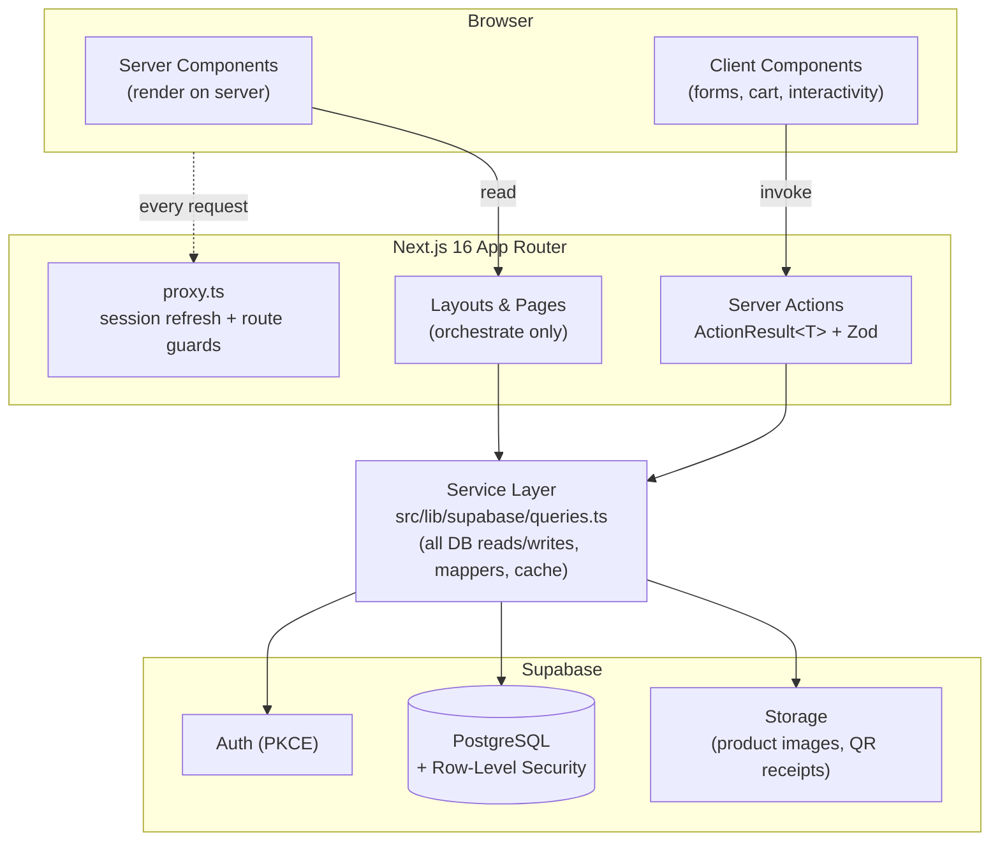
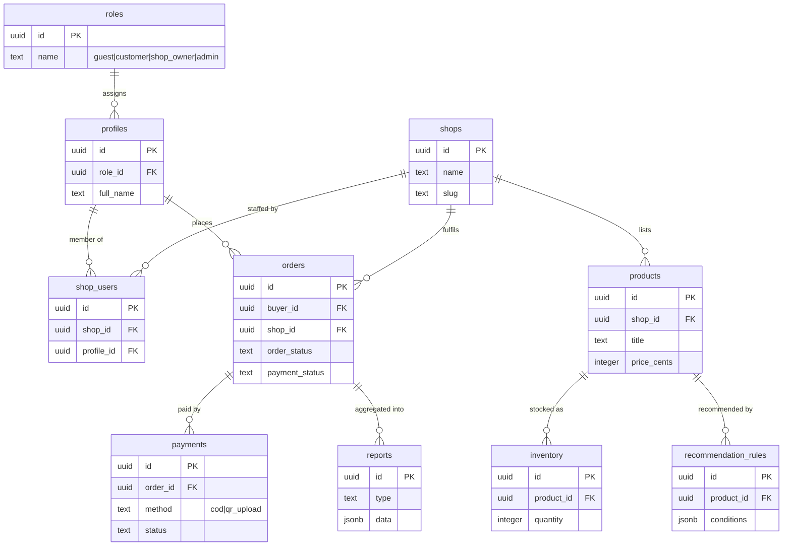
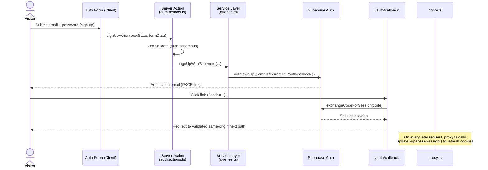
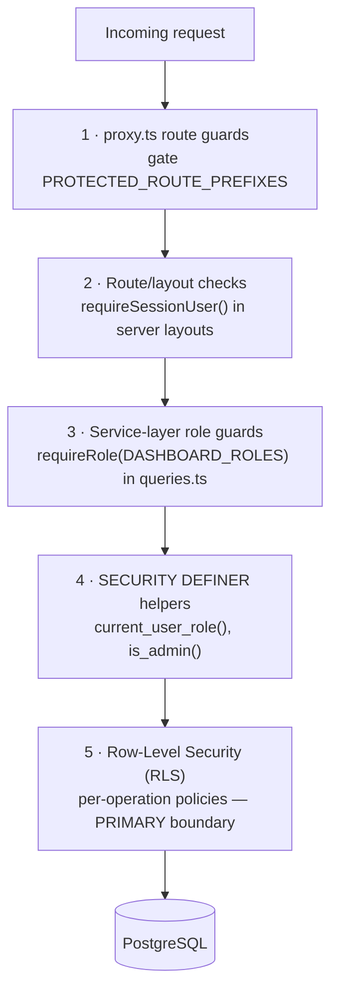
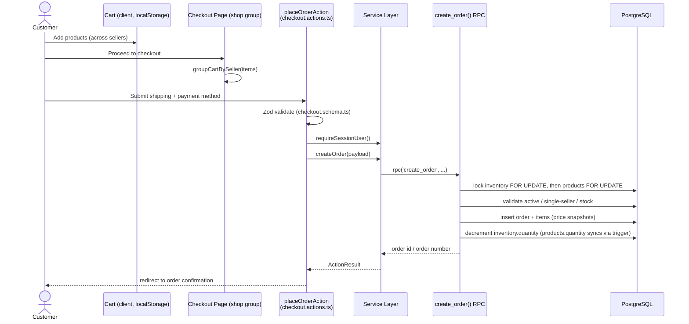
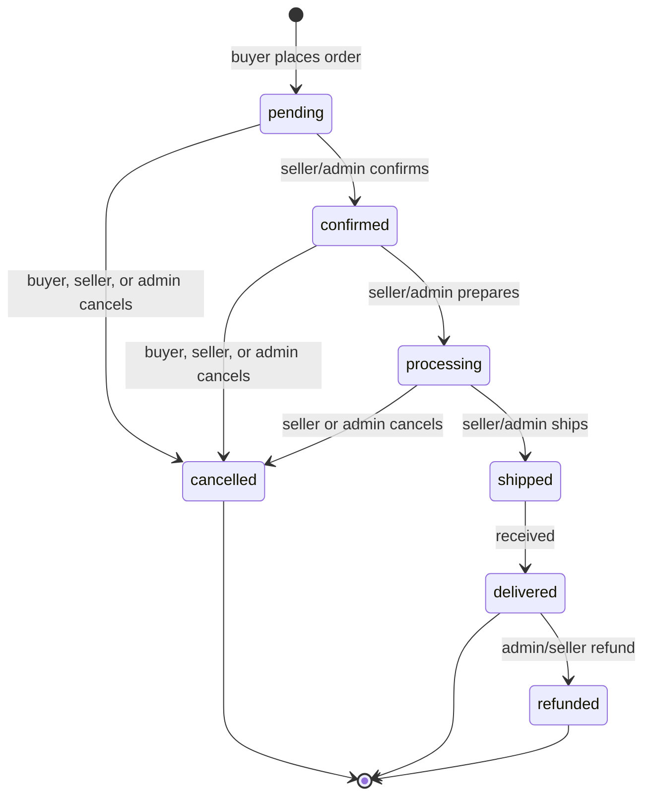

# RoberJ Online Shop — Architecture

> [!IMPORTANT]
> **Read this first.** This is the technical specification for RoberJ Online Shop. It describes the **target architecture** (per the Software Architecture Document, the authoritative business spec) and honestly documents where the **current code** differs.
>
> - Business context & scope → **[README.md](./README.md)**
> - AI/developer working agreement → **[CLAUDE.md](./CLAUDE.md)**
> - *Why* each choice below was made → **[DECISIONS.md](./DECISIONS.md)** (ADR log)
> - Per-module ownership (pages/components/actions/tables) → **[MODULES.md](./MODULES.md)**
> - Next.js 16 framework conventions → **[AGENTS.md](./AGENTS.md)** (read `node_modules/next/dist/docs/` before writing framework code)
>
> When the code and the SAD disagree on a **business** rule, the SAD is the target and the code is behind. See [Current Database Mapping](#current-database-mapping-target-vs-current).

---

## Table of Contents

1. [System Design](#system-design)
2. [System Architecture](#system-architecture)
3. [Target Database Schema](#target-database-schema)
4. [Current Database Mapping (Target vs Current)](#current-database-mapping-target-vs-current)
5. [Authentication Flow](#authentication-flow)
6. [RBAC Model](#rbac-model)
7. [API Conventions](#api-conventions)
8. [Module Interactions](#module-interactions)
9. [Folder Architecture](#folder-architecture)
10. [Architecture Evolution Strategy](#architecture-evolution-strategy)
11. [Migration Notes](#migration-notes)
12. [Technical Debt Register](#technical-debt-register)

---

## System Design

RoberJ is a **server-first, service-oriented** web application. Its design rests on a small set of permanent principles:

| Principle | Meaning |
|-----------|---------|
| **Marketplace-first** | One unified catalog over the three sibling shops; the shopper never juggles three storefronts. |
| **Server-first** | Prefer Server Components and Server Actions; ship the minimum client JavaScript. |
| **Role-based** | Every capability is gated by role (Guest / Customer / Shop Owner / Administrator). |
| **Supabase-first** | Auth, PostgreSQL, and Storage are Supabase; RLS is the primary authorization boundary. |
| **Service layer** | All database access flows through one centralized service module — never from pages or components. |
| **Reusable components** | UI is composed from a shared, business-agnostic component library. |
| **Rule-based recommendation** | Guided Product Selection uses explicit rules, never AI/ML. |
| **Manual payment verification** | COD + QR receipt upload, verified by a human; no payment gateway in scope. |
| **Responsive by default** | Mobile-first; every surface handles loading / error / empty / success. |

### Technology Stack (as implemented)

| Layer | Technology | Version |
|-------|-----------|---------|
| Framework | Next.js (App Router) | `16.2.12` |
| UI runtime | React / React DOM | `19.2.4` |
| Language | TypeScript | `^5` |
| Styling | Tailwind CSS v4 (`@tailwindcss/postcss`) | `^4` |
| Data platform | Supabase (`@supabase/ssr`, `@supabase/supabase-js`) | `^0.12.4` / `^2.111.0` |
| Server state | TanStack React Query | `^5.101.4` |
| Validation | Zod | `^4.4.3` |
| Motion / icons | framer-motion / lucide-react | `^12` / `^1.28` |
| Styling utils | class-variance-authority, clsx, tailwind-merge | — |

> [!NOTE]
> There is **no dedicated test runner** installed (no Jest/Vitest/Playwright). The only automated flow is the Node script in `scripts/` (`e2e-flow.mjs`). See [Testing Expectations in CLAUDE.md](./CLAUDE.md#testing-expectations).
>
> The Stripe payments spike (ADR-014) has been **retired and removed** — Checkout is COD-only until the target QR-upload path (ADR-008) ships.

---

## System Architecture

Requests flow from the browser through Next.js (with a session-refreshing proxy), into Server Actions, down to a single service layer, and finally to Supabase. **Pages orchestrate. Components present. The service layer owns data.**



**The canonical data-flow rule:**

```text
Page → Server Action → Service (queries.ts) → Supabase client → PostgreSQL
```

- **Pages never import a Supabase client directly.** They call Server Actions or read through the service layer.
- **Components never contain business logic.** They receive data and callbacks as props.
- **The service layer is the only place `.from()` / `.rpc()` is called.**

Key files:

| Concern | File |
|---------|------|
| Browser Supabase client | `src/lib/supabase/client.ts` |
| Server Supabase client (+ admin) | `src/lib/supabase/server.ts` |
| Session refresh helper | `src/lib/supabase/session.ts` |
| Centralized service/query layer | `src/lib/supabase/queries.ts` |
| Generated/hand-written DB types | `src/lib/supabase/database.types.ts` |
| Middleware (session + guards) | `src/proxy.ts` |
| Action result envelope | `src/types/action.types.ts` |
| Routes / roles / statuses | `src/constants/*` |

---

## Target Database Schema

Per the SAD **Database Architecture**, the target model is shop-centric: shops list products, products carry inventory, customers place orders, orders carry payments, and rules drive recommendations.

**Target tables:** `profiles`, `roles`, `shops`, `shop_users`, `products`, `inventory`, `orders`, `payments`, `recommendation_rules`, `reports`.



> [!NOTE]
> This ERD is the **target** derived from the SAD. Column names are indicative. The authoritative money convention (below) and lifecycle rules come from the current, reviewed schema and should carry forward.

**Design invariants to preserve when building toward the target:**

- **Money is stored as integer minor units** (`*_cents`), never floats.
- **Financial and historical rows are append-mostly:** no `DELETE` policy on orders / order items / payments; price and title are **snapshotted** onto order lines so later product edits never rewrite history.
- **Order lifecycle timestamps** (`placed_at`, `paid_at`, `shipped_at`, `delivered_at`, `cancelled_at`) are set by triggers, not clients.
- **Stock decrements happen atomically** inside a `SECURITY DEFINER` RPC that locks `inventory` rows `FOR UPDATE` (before `products`, on purpose — see the Inventory section below).

---

## Current Database Mapping (Target vs Current)

> [!NOTE]
> **The canonical Target-vs-Current mapping (roles, `shops`, `inventory`, `payments`, `recommendation_rules`, `reports`, cart) lives in one place: [README.md → Implementation Status](./README.md#implementation-status-target-vs-current).** This section does not restate it — it documents what the *current* schema actually contains, which the mapping table doesn't cover.

The live schema (see `supabase/migrations/*.sql` and `src/lib/supabase/database.types.ts`) implements a reviewed subset. Roles are an enum on `profiles`; "shops" are currently **seller accounts**.

**Current tables:** `profiles`, `categories`, `products`, `product_images`, `orders`, `order_items`, `payments`, `shops`, `shop_users`, `inventory`, `stock_adjustments`, `admin_action_log`.

**Current enums:** `user_role (buyer|seller|admin)`, `product_status (draft|active|sold|archived)`, `product_condition (new|like_new|good|fair|poor)`, `payment_method_type (cod|card|qr_upload — `card` is inert legacy from the retired Stripe spike)`, `payment_status (pending|paid|failed|refunded|partially_refunded)`, `order_status (pending|confirmed|processing|shipped|delivered|cancelled|refunded)`, `stock_adjustment_reason (initial_stock|restock|correction|sale|cancellation_restock|shrinkage|other)`.

**Current DB functions:** `create_order`, `is_admin`, `current_user_role`, `get_my_profile`, `slugify`, `is_shop_member`, `adjust_stock`, `admin_assign_seller_shop`, `admin_list_users`.

> [!NOTE]
> **`shops`/`shop_users` exist as of the Phase 2 migration (`20260813000000_shops_and_shop_users.sql`), but this is a foundation, not a completed cutover.** Each existing `seller` profile was backfilled into exactly one `shops` row via `shop_users` (one shop, one member, today). `products.seller_id` and `orders.seller_id` were deliberately **not** touched — they still directly reference `profiles.id`, and RLS/`create_order`/`submit_qr_payment`/`verify_payment`/`enforce_order_update_rules` all still operate on `seller_id` exactly as before. There is no `products.shop_id` or `orders.shop_id` column yet; "which shop does this seller belong to" is only resolvable via a `shop_users` join today. The `is_shop_member(shop_id)` DEFINER helper mirrors `is_admin()`'s shape specifically so a later migration can reuse it once `shop_id` lands on `products`/`orders`. See TD-1 below.

> [!NOTE]
> The SAD's payment path — **COD + QR receipt upload + manual verification** — is now implemented. The `payments` table's Stripe-only columns were dropped when QR was built (this closed TD-3); `payments` now holds `receipt_path` (a private Storage object path, not a public URL), `verified_by`/`verified_at` (the manual-verification audit trail), and the `qr_upload` payment method. `submit_qr_payment`/`verify_payment` are the sole write RPCs — see [Payments RPCs](#payments-rpcs-qr-receipt-upload-manual-verification) below.

> [!NOTE]
> **Inventory is now a dedicated `inventory` table** (`20260815000000_inventory_and_stock_history.sql`), closing TD-2. `products.quantity` is **not** dropped — it is a trigger-synced, read-only-by-convention mirror (`inventory_sync_products_quantity`), kept accurate via a column-level `REVOKE UPDATE (quantity) ON products FROM authenticated`, so every existing buyer-facing read path (PDP, catalog tiles, cart, `getProductsPriceAndStock`) keeps reading `products.quantity` unchanged. An append-only `stock_adjustments` table records every movement (sale, manual restock/correction/shrinkage, cancellation restock, the initial backfill) with who/why/when. `adjust_stock` is the sole manual-write RPC; `create_order` now locks and decrements `inventory` instead of `products` directly; a DB trigger restocks automatically when an order transitions to `cancelled`. See [Architecture Evolution Strategy](#architecture-evolution-strategy) below for the full design.
>
> **Accepted limitation:** the products↔inventory sync depends on the trigger chain staying intact — there is no cross-table CHECK constraint enforcing `products.quantity = inventory.quantity` (Postgres cannot express one declaratively). This is a documented, accepted risk, not a solved one.

> [!NOTE]
> **Seller onboarding is now Admin-controlled, no direct SQL required** (`20260816000000_admin_user_shop_management.sql`). `profiles` UPDATE RLS is self-only (`id = auth.uid()`, never widened with `is_admin()`), so a `SECURITY DEFINER` RPC — `admin_assign_seller_shop(p_user_id, p_shop_id)` — is the sole path for an admin to promote a buyer to seller and/or (re)assign their shop: it explicitly checks `is_admin()` inside (never trusts RLS alone, same as `create_order`/`adjust_stock`), flips `profiles.role` when the target is a `buyer`, deletes any existing `shop_users` row for that user and inserts the new one (atomic — no window with zero or two memberships), and logs one row to the new `admin_action_log` table. A `shop_users` `unique (user_id)` constraint backs this at the schema level. `admin_list_users()` is a second new `SECURITY DEFINER` RPC (mirrors `get_my_profile()`'s shape, admin- rather than self-scoped) — the only place `auth.users.email` is joined into any query, since email isn't otherwise reachable from `public.profiles`. Shop create/edit needed no new RPC — `shops` RLS already had `is_admin()` in it. Public signup is untouched and remains Buyer-only.

For what each gap requires to close, see [Architecture Evolution Strategy](#architecture-evolution-strategy) below.

### The `create_order` RPC (current, sanctioned checkout path)

`create_order` is the single sanctioned way to place an order today. It is `SECURITY DEFINER` and:

1. Derives `buyer_id` from `auth.uid()` — **never** a client parameter.
2. Locks the referenced `inventory` row `FOR UPDATE`, then the `products` row (in that order — see the note below on why).
3. Validates: products are `active`, single seller per order, single currency, sufficient stock (checked against `inventory.quantity`).
4. Inserts the order and its line items with **price/title snapshots**.
5. Decrements `inventory.quantity`; a sync trigger mirrors the new value onto `products.quantity` and flips `sold`/`active` at the zero-stock boundary — see the Inventory note above.
6. Raises typed errors (e.g. `Only % left of %`) that the service layer maps to friendly messages.

> [!NOTE]
> **Lock ordering is inventory-then-products, not the reverse.** `adjust_stock` (the manual-adjustment RPC) only ever takes a direct lock on `inventory`; its later write to `products.quantity` happens *inside* the sync trigger, while the `inventory` lock is still held. For `create_order` to never deadlock against a concurrent `adjust_stock` call on the same product, it must acquire its own `inventory` lock before its `products` lock too. Both RPCs are written this way — see the migration's header comment for the full reasoning.

Column-level update rules are enforced by an `enforce_order_update_rules` trigger: financial/identity fields are immutable, only the seller advances fulfilment, the buyer may only cancel, and `payment_status` is never client-driven **except** the one narrow case below (a seller manually verifying their own order's QR payment).

### Payments RPCs (QR receipt upload + manual verification)

Two `SECURITY DEFINER` RPCs are the sole write path into `payments` — no direct INSERT/UPDATE grant exists on the table, mirroring `create_order`'s chokepoint philosophy:

- **`submit_qr_payment(p_order_id, p_receipt_path)`** — buyer submits a receipt for their own order (`buyer_id = auth.uid()`, checked inside the RPC). Rejects a second submission while one is `pending`/`paid` for that order (a prior `failed` one doesn't block resubmission). Re-prices from the order's own `total_cents`/`currency`, never a client-supplied amount.
- **`verify_payment(p_payment_id, p_decision)`** — the order's seller or an admin marks a `pending` payment `paid`/`failed`. Locks both the `payments` and `orders` rows `FOR UPDATE` before touching either (one transaction, not two independent client-driven writes), then updates `orders.payment_status` to match. Refuses to re-decide an already-decided payment.

The `enforce_order_update_rules` trigger has a narrow exception for this last step: a seller may move their **own** order's `payment_status` from `pending` to `paid`/`failed` (not any other transition, not admin-restricted — the SAD's target path is "Administrator **or** Shop Owner"). This is a small, in-place addition to the existing `payment_status` check, not a widened bypass — financial-field immutability and the fulfilment-status rule are untouched.

Receipt images live in the private `payment-receipts` Supabase Storage bucket, path `{order_id}/{uuid}.{ext}`. RLS on `storage.objects` authorizes via a subquery against `orders` (buyer, seller, or admin of that order) — the object path is never trusted as identity on its own.

### Reporting RPCs (analytics over existing orders)

Reports & analytics are **computed DB-side by four read-only `SECURITY DEFINER` RPCs** over the existing `orders`/`order_items`/`payments` — there is **no `reports` table** (the SAD's `reports` entity is realised as derived aggregates, not a stored, duplicative table). Added in `20260818000000_reports_analytics_rpcs.sql`:

- **`report_sales_summary(p_from, p_to, p_shop_id)`** — one KPI row: total/paid/cancelled/pending-payment orders, paid revenue, units sold, average order value, and the COD-vs-QR paid split. Always returns exactly one row (zeros for an empty range).
- **`report_sales_timeseries(p_from, p_to, p_granularity, p_shop_id)`** — order count + paid revenue per `day`/`week`/`month` bucket.
- **`report_order_status_breakdown(p_from, p_to, p_shop_id)`** — order counts per fulfilment status.
- **`report_top_products(p_from, p_to, p_limit, p_shop_id)`** — best-selling products by units (revenue over the paid subset), from the `order_items` snapshots.

Design rules baked into all four (mirroring `verify_payment`/`adjust_stock`):

- **Scoping is re-enforced inside each function** (DEFINER bypasses RLS): a seller sees only `seller_id = auth.uid()`; an admin sees every order, optionally narrowed to one shop via `p_shop_id` (mapped shop→seller through `shop_users`, since `orders` has no `shop_id` — see TD-1). A seller's `p_shop_id` is **ignored**, so scope can never be widened. Non-seller/non-admin callers are rejected (`42501`); `EXECUTE` is granted to `authenticated` only (never `anon`).
- **Single date axis:** every metric buckets on `placed_at`, interpreted in **`Asia/Manila`** (the PHP business timezone). Inclusive calendar range `[p_from, p_to]`.
- **Consistent metric rule:** count/volume metrics include every order *placed* in range; monetary metrics count only the `payment_status = 'paid'` subset — the confirmed-revenue source of truth that covers both COD and QR (payments rows are never summed directly, since a COD order may have zero payment rows and an order may accrue several).

Two additive indexes back the date-range scans: `orders (seller_id, placed_at desc)` and `orders (placed_at desc)`. The service layer (`getSalesSummary`/`getSalesTimeseries`/`getOrderStatusBreakdown`/`getTopProducts`, plus `getLowStockReport` reusing the RLS-scoped inventory read) calls these via `.rpc()`; charts are hand-rolled SVG/CSS in `src/components/charts` (no new dependency). Resolves TD-5.

---

## Authentication Flow

Authentication is **Supabase Auth** with email/password and **PKCE** email verification. Sessions are refreshed on every request in `src/proxy.ts`; the code-exchange happens in `src/app/auth/callback/route.ts`.



**Rules baked into the flow:**

- Every auth action validates input with Zod **before** touching Supabase, and returns an `ActionResult`.
- Raw Supabase error messages are **mapped** to safe, friendly copy (`auth-errors.ts`) — internals never leak.
- Password reset **always reports success** (no account-enumeration signal).
- The callback validates that `next` is a **same-origin** path (open-redirect guard).
- `proxy.ts` redirects unauthenticated users away from protected prefixes (preserving `redirectTo`) and authenticated users away from auth routes.

Relevant files: `src/features/auth/actions/auth.actions.ts`, `src/features/auth/schemas/auth.schema.ts`, `src/features/auth/constants/auth-errors.ts`, `src/app/auth/callback/route.ts`, `src/lib/supabase/session.ts`, `src/proxy.ts`.

---

## RBAC Model

Authorization is enforced **in depth** — no single layer is trusted alone. A request must pass every applicable layer.



| Layer | Where | Responsibility |
|-------|-------|----------------|
| **Route guards** | `src/proxy.ts` + `src/constants/routes.ts` | Redirect unauthenticated users away from `PROTECTED_ROUTE_PREFIXES`; keep `/cart` public (client-side guest cart). |
| **Layout checks** | e.g. `src/app/(account)/layout.tsx` | Server-side `requireSessionUser()` — belt-and-suspenders. |
| **Service guards** | `src/lib/supabase/queries.ts` | `requireSessionUser()` / `requireRole(allowed)` at the top of protected operations. |
| **DEFINER helpers** | SQL functions | `current_user_role()`, `is_admin()` — called inside RLS to avoid recursion on `profiles`. |
| **RLS** | `supabase/migrations/*.sql` | **Primary** authorization boundary: per-operation, per-role policies on every table. |

**Role mapping:** for the full SAD-role ↔ code-role mapping, see [README.md → Implementation Status](./README.md#implementation-status-target-vs-current). The one RBAC-specific fact not covered there: `DASHBOARD_ROLES` (`src/constants/roles.ts`) grants dashboard access to `seller` and `admin` only — `buyer` and unauthenticated visitors never reach `/dashboard`.

**RLS highlights (current):**

- `profiles` are publicly readable, but self-insert is forced to `role = 'buyer'` and self-update **cannot** change role (backed by a `prevent_role_self_escalation` trigger — `WITH CHECK` can't see `OLD`).
- `products` insert requires `current_user_role() in ('seller','admin')`.
- `categories` writes require `is_admin()`.
- `orders` are readable by buyer/seller/admin; buyer-only insert; updates column-guarded; **no DELETE policy** (financial immutability).
- `payments` are read-only to order participants/admin; writes only via `service_role`.
- Sensitive columns (e.g. `phone`) are withheld by column-level grants and only exposed through the `get_my_profile()` DEFINER RPC.

---

## API Conventions

RoberJ has **no REST controllers**. The "API layer" is **Next.js Server Actions**. Every mutation and protected read follows one uniform shape.

### `ActionResult<T>`

All Server Actions return a discriminated result (`src/types/action.types.ts`, helpers in `src/lib/utils/result`):

```ts
// Success
{ ok: true, data: T }
// Failure (friendly, mapped message + optional field errors)
{ ok: false, error: string, fieldErrors?: Record<string, string[]> }
```

Helpers: `ok(data)`, `fail(message)`, `fromZodError(error)`.

### Server Action pattern (canonical)

```ts
"use server";

export async function doThingAction(prevState: ActionResult, formData: FormData) {
  // 1. Validate at the boundary
  const parsed = thingSchema.safeParse(Object.fromEntries(formData));
  if (!parsed.success) return fromZodError(parsed.error);

  // 2. Authorize (defense in depth — RLS still applies underneath)
  await queries.requireRole(DASHBOARD_ROLES);

  // 3. Delegate to the service layer (never touch Supabase here)
  const result = await queries.createThing(parsed.data);

  // 4. Revalidate affected routes / redirect
  revalidatePath("/things");
  return ok(result);
}
```

**Rules:**

1. **Validate with Zod first.** Never trust `formData`.
2. **Authorize before mutating.** Use `requireSessionUser` / `requireRole`; never assume the proxy already blocked it.
3. **Delegate to `queries.ts`.** Actions orchestrate; the service layer executes.
4. **Normalize errors.** Map raw provider errors to friendly copy; never surface internals.
5. **Revalidate deliberately.** Call `revalidatePath` / `revalidateTag` for exactly what changed.
6. **Return `ActionResult<T>`.** UI branches on `ok`.

### Service layer conventions (`queries.ts`)

- Column selections are **literal strings** (`PRODUCT_COLUMNS`, `ORDER_COLUMNS`) so Supabase can infer joined types.
- Row→domain **mappers** (`toProduct`, `toOrder`, `toProfile`) convert snake_case rows to camelCase domain models.
- Request-shared reads are wrapped in React `cache()` (`getProductBySlug`, `getBuyerOrder`, `getMarketplaceStats`, …).
- Domain **types** (camelCase) live in `features/<name>/types` and are kept distinct from DB row types in `database.types.ts`.

---

## Module Interactions

> For per-module ownership (which files, which tables, which status) rather than cross-module flows, see **[MODULES.md](./MODULES.md)**. This section covers only how modules talk to each other.

### Checkout Flow (current)



> [!NOTE]
> **Target payment path — implemented:** at checkout the Customer selects **COD** or **QR Transfer** (informational only at that point — nothing is persisted until the buyer actually acts). For QR, the buyer uploads a receipt from their order detail page (`submitQrPaymentAction`), storing the image in Supabase Storage; the payment sits `pending` until the Administrator **or Shop Owner** manually verifies it (`verifyPaymentAction`, `/dashboard/payments`). The Stripe/card spike that previously sat alongside COD has been **removed** (ADR-014).

### Order Flow (lifecycle)



- The **seller** (or admin) advances fulfilment states and may cancel through `processing` (`ORDER_STATUS_TRANSITIONS`, app-enforced — the DB trigger itself permits the seller to set any status); the **buyer** may only cancel, and only while `pending`/`confirmed` (`CANCELLABLE_ORDER_STATUSES`, narrower and unchanged by the dashboard's wider window).
- Cancelling from any actor restocks automatically via the `orders_restock_on_cancel` trigger (see Inventory) — it's actor-agnostic by construction.
- `payment_status` transitions are **never** client-driven (server/webhook/manual-verification only), and are **independent** of `order_status` — no constraint or trigger couples them (see TD-9).
- Status changes stamp lifecycle timestamps via triggers.

---

## Folder Architecture

```text
src/
├── app/            Routes ONLY. Route groups: (marketing) (auth) (shop) (account).
│                   Pages orchestrate features; they never import a Supabase client.
├── components/     Shared, business-agnostic UI: ui/ layout/ feedback/ forms/
│                   navigation/ brand/ tables/ charts/.
├── features/       Self-contained domains. Built: auth, products, categories, cart,
│                   landing, account, orders, checkout, payments. Stubs (upcoming):
│                   assistant, dashboard, inventory, notifications, reports.
├── lib/
│   ├── supabase/   client.ts server.ts session.ts queries.ts database.types.ts
│   ├── auth/       permissions.ts
│   ├── cache/      tags.ts
│   ├── utils/      cn, currency, date, format, result
│   └── validations/ common.schema.ts
├── hooks/          useDebouncedValue, useMediaQuery
├── providers/      AppProviders, QueryProvider
├── services/       Reserved for cross-feature services (placeholder today)
├── config/         env.ts (validated), site.ts
├── constants/      routes, roles, status, query-keys, pagination, database
├── types/          action.types, common.types, pagination.types
└── proxy.ts        Next.js 16 middleware (session refresh + route protection)
```

**Boundary rules** (enforced by convention, checked in review):

- `app/` → may import from `features/`, `components/`, `lib/`, `constants/`. **Never** calls Supabase directly.
- `features/<a>/` → **should not** import from `features/<b>/` internals; share via `lib/`, `components/`, or barrels.
- `components/` → business-agnostic; no Supabase, no Server Actions.
- `lib/supabase/queries.ts` → the **only** module that calls `.from()` / `.rpc()`.

---

## Architecture Evolution Strategy

The code converges toward the SAD **without breaking the build at any step**. Recommended order (mirrors the roadmap in the README):

1. ~~**Introduce `shops` + `shop_users`.**~~ **Foundation done** (`20260813000000_shops_and_shop_users.sql`) — tables, RLS, `is_shop_member()`, and a backfill exist; each `seller` profile has exactly one `shops` row via `shop_users`. `products.shop_id` now exists too (`20260814000000_products_shop_scoping.sql`), consumed by the shop-scoped Products dashboard. **Remaining:** `orders.seller_id` still references `profiles.id` directly — no `shop_id` column on `orders` yet. Add it, update `orders` RLS/`create_order`/`enforce_order_update_rules` to use it, and migrate checkout/cart's per-seller grouping to per-shop, once an Orders dashboard actually needs shop-scoped order data — not speculatively.
2. ~~**Extract `inventory`.**~~ **Done** (`20260815000000_inventory_and_stock_history.sql`) — stock moved from `products.quantity` into a dedicated `inventory` table (`products.quantity` kept as a trigger-synced mirror for backward compatibility); `create_order` is atomic against `inventory` (locks `inventory` rows `FOR UPDATE`, before `products`); an append-only `stock_adjustments` table records every movement; manual changes go through the `adjust_stock` RPC; order cancellation auto-restocks via a trigger. See the Inventory note under [Current Database Mapping](#current-database-mapping-target-vs-current).
3. ~~**Implement Payments (target).** Add `qr_upload` method + receipt storage + manual verification workflow. Drop the now-unused Stripe columns from `payments`.~~ **Done.** See [Payments RPCs](#payments-rpcs-qr-receipt-upload-manual-verification). The Admin/Shop Owner dashboard has since grown well beyond that single page — Products, Inventory, Orders, and now Users/Shops (seller onboarding, `20260816000000_admin_user_shop_management.sql`) are all built (`/dashboard/{products,inventory,orders,users,shops}`), all following the same "RLS is the primary boundary, no manual filtering" pattern for reads, with `SECURITY DEFINER` RPCs reserved for the genuinely cross-user/no-direct-grant writes (and now cross-user **read** aggregation for Reports). Remaining: platform Settings.
4. **Add `recommendation_rules`** and build the rule-based Guided Product Selection engine behind `features/assistant`.
5. ~~**Add `reports` aggregates and build `features/reports`.**~~ **Done** (`20260818000000_reports_analytics_rpcs.sql`) — realised as four read-only `SECURITY DEFINER` aggregation RPCs over existing `orders`/`order_items`/`payments` (no physical `reports` table), a shop/admin-scoped `/dashboard/reports` page, and hand-rolled SVG/CSS charts. See [Reporting RPCs](#reporting-rpcs-analytics-over-existing-orders). Resolves TD-5.

**Guardrails during evolution:**

- Every schema change is a new, idempotent, transactional migration under `supabase/migrations/`.
- Regenerate `database.types.ts` after every schema change.
- Preserve money-as-cents, append-mostly financial rows, and the DEFINER + RLS security model.
- Land each module with `npm run lint` + `npm run typecheck` + `npm run build` green.

---

## Migration Notes

- Migrations live in `supabase/migrations/` and are **transactional** (`begin`/`commit`) and **idempotent**.
- Current migration set:
  1. `20260802000100_initial_schema.sql` — enums, tables, functions, triggers, indexes, RLS.
  2. `20260802160000_security_hardening.sql` — RLS audit remediation (F1–F5).
  3. `20260803000100_rls_hardening.sql` — revoke-all-then-regrant least-privilege pass.
  4. `20260804000000_restore_profiles_column_grants.sql` — re-scope `profiles` SELECT (fix `phone` leak).
  5. `20260804000100_add_get_my_profile.sql` — ensure `get_my_profile()` DEFINER RPC exists.
  6. `20260804000200_add_payments.sql` — `payment_method_type` enum + `payments` table + RLS.
  7. `20260804000300_revoke_create_order_anon_execute.sql` — restrict `create_order` EXECUTE to `authenticated`.
  8. `20260807000000_add_rate_limiting.sql` — `rate_limit_hits` table + `check_rate_limit()` fixed-window RPC.
  9. `20260807010000_evolve_payments_for_qr.sql` — `qr_upload` payment method; drops Stripe-only `payments` columns (resolves TD-3); adds `verified_by`/`verified_at`; renames `receipt_url` → `receipt_path`.
  10. `20260807020000_qr_payment_rpcs.sql` — `submit_qr_payment()`/`verify_payment()` RPCs; narrow `enforce_order_update_rules` fix for seller self-verification.
  11. `20260807030000_payment_receipts_storage.sql` — private `payment-receipts` Storage bucket + RLS (first Storage feature in this repo).
  12. `20260807040000_profiles_payment_qr_url.sql` — seller's receiving QR code (`profiles.payment_qr_url`).
  13. `20260813000000_shops_and_shop_users.sql` — `shops`/`shop_users` tables, `is_shop_member()`, RLS, idempotent backfill (one shop per existing `seller`). `products`/`orders`/`payments` untouched — see TD-1.
  14. `20260814000000_products_shop_scoping.sql` — adds `products.shop_id`, widens `products` RLS to accept shop membership additively; `orders`/`payments` untouched.
  15. `20260815000000_inventory_and_stock_history.sql` — `inventory`/`stock_adjustments` tables + `stock_adjustment_reason` enum, seed/sync/restock triggers, `adjust_stock` RPC, `create_order` replaced to lock/decrement `inventory` instead of `products`, idempotent backfill, column-level `REVOKE UPDATE (quantity)` on `products` for `authenticated`. Resolves TD-2.
  16. `20260816000000_admin_user_shop_management.sql` — `shop_users` gains `unique (user_id)`; new `admin_action_log` table + RLS; `admin_assign_seller_shop`/`admin_list_users` RPCs. No changes to `products`/`orders`/`inventory`/`payments`.
  17. `20260817000000_fix_profiles_payment_qr_url_select_grant.sql` — bug fix: grants `SELECT (payment_qr_url)` to `authenticated`, missing since `20260807040000` added the column with only an `UPDATE` grant. Every query using `ORDER_COLUMNS` (all buyer *and* dashboard order reads) was failing outright with "permission denied for table profiles" until this landed — column-privilege checks apply to every column referenced in a query regardless of row count, so this broke Orders unconditionally, not just QR-code display.
  18. `20260818000000_reports_analytics_rpcs.sql` — Reports & analytics: four read-only `SECURITY DEFINER` aggregation RPCs (`report_sales_summary`/`report_sales_timeseries`/`report_order_status_breakdown`/`report_top_products`) over existing `orders`/`order_items`/`payments`, `EXECUTE` to `authenticated` only, seller/admin scoping re-enforced inside; plus two additive `orders` indexes (`orders_seller_placed_idx`, `orders_placed_at_idx`). No table/enum/RLS/trigger changes to existing objects. Resolves TD-5.
- **Type regeneration** after any schema change:
  ```bash
  npx supabase gen types typescript --project-id <project-id> > src/lib/supabase/database.types.ts
  ```

> [!NOTE]
> `database.types.ts` is currently **hand-written** to mirror the initial migration for the tables in use (`profiles`, `categories`, `products`, `product_images`, `orders`, `order_items`, `payments`). Keep it in lockstep with migrations.

---

## Technical Debt Register

**Policy:** every intentional gap between the current code and the SAD target gets a row here — added in the same PR that introduces or discovers it (see [CONTRIBUTING.md → Documentation update requirements](./CONTRIBUTING.md#documentation-update-requirements)). A row is removed only when the gap is closed, not when it becomes inconvenient to look at. This is the honest ledger — keep it current, and prefer adding a row over silently shipping a workaround.

| # | Item | Impact | Target resolution |
|---|------|--------|-------------------|
| TD-1 | **`shops`/`shop_users` exist (Phase 2 foundation) but `products`/`orders` still key off `seller_id`, not `shop_id`** — no FK bridge yet | Products/Orders/Inventory cannot yet query "all data for my shop"; multi-staff-per-shop is modelable (`shop_users` is a proper junction) but nothing consumes it yet | Evolution step 1 (partially done — see note above) |
| ~~TD-2~~ | ~~Inventory is `products.quantity`~~ | **Resolved** — dedicated `inventory`/`stock_adjustments` tables landed in `20260815000000_inventory_and_stock_history.sql`. | — |
| ~~TD-3~~ | ~~Stripe columns on `payments`~~ | **Resolved** — dropped in `20260807010000_evolve_payments_for_qr.sql` when QR payments were built. | — |
| TD-4 | **No `recommendation_rules`** — Guided Selection is a landing preview only | Core SAD feature unbuilt | Evolution step 4 |
| ~~TD-5~~ | ~~No `reports` table / module~~ | **Resolved** — Reports & analytics shipped as four `SECURITY DEFINER` aggregation RPCs over existing `orders`/`order_items`/`payments` (`20260818000000_reports_analytics_rpcs.sql`) + `/dashboard/reports`. No physical `reports` table was modelled by design (derivable data). | — |
| TD-6 | **No test runner** (only `scripts/*.mjs`) | Limited automated regression safety | Add a runner when justified (see CLAUDE.md) |
| TD-7 | **`roles` as enum**, not a table | Minor divergence from SAD DB list | Model a `roles` table if/when role metadata is needed |
| TD-8 | **`database.types.ts` hand-written** | Drift risk vs migrations | Regenerate from Supabase once project is provisioned |
| TD-9 | **A rejected/failed QR payment does not restock** — stock was already decremented at order placement (`create_order`), independent of payment outcome; `verify_payment` never touches `inventory` | A buyer's failed payment leaves the seller short that stock until manually corrected. **Partially mitigated (Orders phase):** the seller/admin can now cancel the order from `/dashboard/orders`, which restocks automatically via `orders_restock_on_cancel` — a manual remedy exists, so stock doesn't stay silently wrong forever. The underlying business-rule question is still open. | Still deferred — requires a Payments-module business-rule decision first (does a failed payment also auto-cancel the order automatically?) before an automatic restock trigger can be added safely |

---

### Related documents

- 🧭 **[README.md](./README.md)** — business overview, scope, roadmap, repository map.
- 🤖 **[CLAUDE.md](./CLAUDE.md)** — coding standards, workflow, non-negotiables, Definition of Done.
- 📜 **[DECISIONS.md](./DECISIONS.md)** — architecture decision records (ADRs) behind this design.
- 🗂️ **[MODULES.md](./MODULES.md)** — per-module ownership, status, and files.
- 🛠️ **[CONTRIBUTING.md](./CONTRIBUTING.md)** — migration/PR workflow for changes to this architecture.
- 📋 **[AGENTS.md](./AGENTS.md)** — Next.js 16 framework ground rules.
