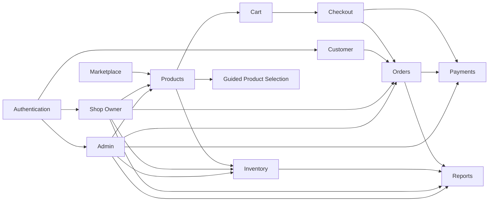

# MODULES.md — Module Reference

> [!IMPORTANT]
> **Read this first.** This is the authoritative map of module ownership: what each module is for, what it owns, and exactly how built it is. Use it to answer *"where does X live?"* and *"is Y already built?"* before writing code.
>
> Business purpose → [README.md → Core Modules](./README.md#core-modules) · Technical design → [ARCHITECTURE.md](./ARCHITECTURE.md) · Why each module is shaped this way → [DECISIONS.md](./DECISIONS.md) · Standards for touching a module → [CLAUDE.md](./CLAUDE.md).
>
> For the canonical **Target vs Current** mapping (roles, tables, payments, cart) referenced throughout the rows below, see [README.md → Implementation Status](./README.md#implementation-status-target-vs-current) — it is not repeated per-module here.

**Status legend:** ✅ Completed · 🚧 In Progress · ⏳ Upcoming (stub only)

---

## 1. Authentication

| Field | Detail |
|---|---|
| **Purpose** | Let Guests become Customers (and staff sign in) securely: registration, login, logout, email verification, password reset. |
| **Responsibilities** | Session issuance/refresh; credential validation; safe error messaging (no account enumeration); redirect-after-auth handling. |
| **Features** | Sign up, sign in, sign out, forgot password, reset password, email verification (PKCE), role-aware post-login redirect. |
| **Pages** | `src/app/(auth)/{sign-in,sign-up,forgot-password,reset-password}/page.tsx`; `src/app/auth/callback/route.ts` (PKCE exchange, not a page). |
| **Components** | `features/auth/components/forms/{LoginForm,RegisterForm,ForgotPasswordForm,ResetPasswordForm}`; `fields/{EmailInput,PasswordInput}`; `layout/{AuthCard,AuthHeader,AuthFooter,AuthLayout,EditorialPanel}`; `feedback/{VerificationPending,AuthSuccessState}`; `AuthButton`. |
| **Server Actions** | `features/auth/actions/auth.actions.ts` — `signInAction`, `signUpAction`, `signOutAction`, `requestPasswordResetAction`, `updatePasswordAction`, `resendVerificationAction`. |
| **Services** | `lib/supabase/queries.ts` (auth section) — `signInWithPassword`, `signUpWithPassword`, `signOut`, `sendPasswordResetEmail`, `updatePassword`, `resendVerificationEmail`, `getSessionUser`. |
| **Database Tables** | `auth.users` (Supabase-managed) · `profiles` (via `handle_new_user` trigger, auto-creates a `buyer` profile row). |
| **Dependencies** | `src/proxy.ts` (session refresh + route gating), `src/constants/routes.ts` (`AUTH_ROUTES`, `PROTECTED_ROUTE_PREFIXES`), `auth-errors.ts` (error mapping). |
| **Current Status** | ✅ Completed. See [`docs` history via git](./ARCHITECTURE.md#migration-notes) — planned in `auth-module-architecture-plan.md`, now fully implemented. |
| **Future Work** | OAuth providers, seller self-upgrade flow — both explicitly out of scope today (see [README.md → Out of Scope](./README.md#out-of-scope) precedent for deliberate exclusions). |

---

## 2. Marketplace

| Field | Detail |
|---|---|
| **Purpose** | The unified storefront experience across all three shops: the landing page and category browsing that make three shops feel like one marketplace. |
| **Responsibilities** | First-impression storefront (hero, featured products/shops, marketplace value props); category-based discovery; entry point into Products. |
| **Features** | Landing hero, featured products/shops, marketplace features section, animated stats, category grid, guided-selection preview teaser. |
| **Pages** | `src/app/(marketing)/page.tsx` (home); `src/app/(shop)/categories/page.tsx`, `categories/[slug]/page.tsx`. |
| **Components** | `features/landing/components/*` (Hero, FeaturedProducts, FeaturedProductsGrid, FeaturedShops, MarketplaceFeatures, SmartAssistantPreview, LandingNavbar, LandingFooter, AboutSection, AnimatedCounter, AnnouncementBar, BackToTop, EditorialBanner, MarqueeBand, ProductCategories, Reveal); `features/categories/components/{CategoryCard,CategoryGrid}`. |
| **Server Actions** | None (read-only, presentational). |
| **Services** | `lib/supabase/queries.ts` (landing stats + categories sections) — `getMarketplaceStats`, category listing queries. |
| **Database Tables** | `categories`, `products` (aggregated), `profiles` (featured-shop placeholder data — see caveat below). |
| **Dependencies** | Products module (links into product listing/detail); no direct dependency on Cart/Checkout. |
| **Current Status** | ✅ Completed (`landing-page-implementation-plan.md` marked Implemented 2026-08-03). |
| **Future Work** | "Featured Shops" is currently a **documented placeholder** — there is no `shops` entity yet (see [DECISIONS.md → ADR-001](./DECISIONS.md#adr-001-marketplace-scoped-to-three-sibling-shops)); wire it to real shop data once the target schema lands. |

---

## 3. Products

| Field | Detail |
|---|---|
| **Purpose** | The product catalog: listing, search, filtering, and detail pages for finished-garment inventory across the three shops. |
| **Responsibilities** | Catalog browsing UX; search/filter/pagination; product detail presentation; related-product suggestions. |
| **Features** | Catalog grid with pagination, filters, search input, breadcrumbs, product detail gallery, related products. |
| **Pages** | `src/app/(shop)/products/page.tsx`; `products/[slug]/{page,loading,not-found}.tsx`. |
| **Components** | `features/products/components/{Breadcrumbs,CatalogHeader,PaginationControls,ProductCard,ProductFilters,ProductGallery,ProductGrid,ProductGridSkeleton,ProductListSection,ProductSearchInput,RelatedProducts}`. |
| **Server Actions** | `features/products/actions/product.actions.ts` — create/update/archive (guarded by `requireRole(DASHBOARD_ROLES)`), used by the (upcoming) Shop Owner/Admin dashboards. |
| **Services** | `lib/supabase/queries.ts` (products section) — `getProductBySlug` (React `cache()`), listing/search/filter queries, `toProduct` mapper. |
| **Database Tables** | `products`, `product_images`, `categories` (FK). |
| **Dependencies** | Marketplace (entry point), Cart (add-to-cart), Inventory concept (`products.quantity` today). |
| **Current Status** | ✅ Completed for browsing/detail. Owner-side create/update actions exist; no dashboard UI consumes them yet (see Admin/Shop Owner modules). |
| **Future Work** | Wire product mutation actions into the Shop Owner/Admin dashboards once built. |

---

## 4. Inventory

| Field | Detail |
|---|---|
| **Purpose** | Track and adjust stock levels per shop so updates happen once, centrally — solving the SAD's "inventory updates are repetitive and slow" problem. |
| **Responsibilities** (target) | Stock level tracking per product (and, in the target schema, per shop); low-stock visibility; manual stock adjustment by shop owners/admin. |
| **Features** (target) | Stock adjustment UI, low-stock indicators, stock history. |
| **Pages** | None yet — reserved under `/dashboard/inventory` (`ROUTES.inventory`). |
| **Components** | None yet — `src/features/inventory/` is a stub (`.gitkeep` placeholders, `index.ts` = `export {}`). |
| **Server Actions** | None yet. |
| **Services** | None yet. Currently, stock is read/written incidentally via `products.quantity` inside `create_order` (atomic decrement) and product actions — **not** a dedicated inventory service. |
| **Database Tables** (current) | `products.quantity` column. |
| **Database Tables** (target) | Dedicated `inventory` table per [ARCHITECTURE.md → Target Database Schema](./ARCHITECTURE.md#target-database-schema). |
| **Dependencies** | Products (stock lives on the product row today); Orders (`create_order` decrements stock). |
| **Current Status** | ⏳ Upcoming (stub). Stock exists functionally via `products.quantity`, but there is no dedicated Inventory module/UI. |
| **Future Work** | Extract `inventory` from `products.quantity` (Evolution Step 2 in [ARCHITECTURE.md](./ARCHITECTURE.md#architecture-evolution-strategy)); build the Shop Owner inventory screen. |

---

## 5. Cart

| Field | Detail |
|---|---|
| **Purpose** | Hold products from any of the three shops in one place before checkout — the "unified cart" the SAD calls for. |
| **Responsibilities** | Add/remove/update line items; persist across page loads (not devices); expose totals to Checkout. |
| **Features** | Add to cart, quantity update, remove item, cart summary, persistent guest cart. |
| **Pages** | `src/app/(shop)/cart/page.tsx` (intentionally **public** — see [DECISIONS.md → ADR-013](./DECISIONS.md#adr-013-guest-cart-is-client-side-only)). |
| **Components** | `features/cart/components/{AddToCartButton,CartSummary}`. |
| **Server Actions** | None — cart is client-only until checkout. |
| **Services** | `features/cart/providers/CartProvider` (Context), `features/cart/hooks/useCart`, `features/cart/utils/cart-reducer` (localStorage-backed `useReducer`). |
| **Database Tables** | None — no server-side cart table by design. |
| **Dependencies** | Products (source of line items); Checkout (consumes cart state, groups by seller). |
| **Current Status** | ✅ Completed. |
| **Future Work** | Optional authenticated-user cart sync across devices (see ADR-013 future revisit) — not currently planned. |

---

## 6. Checkout

| Field | Detail |
|---|---|
| **Purpose** | Convert a cart spanning multiple shops into one order per shop, capturing shipping details and a payment method. |
| **Responsibilities** | Group cart by seller; collect shipping address; select payment method; invoke order creation; surface per-shop totals. |
| **Features** | Shipping address form (country locked to Philippines — domestic-only, no courier API), per-shop order grouping, payment method selection (COD or QR Transfer — QR is informational only at this step, see Payments), order totals, order-confirmation page, empty-cart handling. |
| **Pages** | `src/app/(shop)/checkout/page.tsx`, `checkout/confirmation/page.tsx` (both protected routes). |
| **Components** | `features/checkout/components/{CheckoutEmptyState,CheckoutForm,CheckoutGroupCard,CheckoutItemsList,CheckoutTotals,PaymentMethodCard,ShippingAddressForm}`. |
| **Server Actions** | `features/checkout/actions/checkout.actions.ts` — `placeOrderAction`. |
| **Services** | `lib/supabase/queries.ts` — `createOrder` (wraps the `create_order` RPC), `getBuyerOrder` (confirmation page); `features/checkout/utils/groupCartBySeller`. |
| **Database Tables** | Writes `orders`, `order_items` via `create_order`; reads `products` for price/stock validation. |
| **Dependencies** | Cart (source), Orders (target of creation), Payments (method selection + the actual receipt-upload/verification flow, which lives entirely in the Payments module, not here). |
| **Current Status** | ✅ Completed (the Stripe/card spike, ADR-014, was removed — see [DECISIONS.md → ADR-014](./DECISIONS.md#adr-014-stripe-integration-is-a-provisional-spike)). |
| **Future Work** | None outstanding — `create_order` is deliberately unchanged by the QR payment work; payment method is not persisted at order-placement time (see Payments module). Assumes a single currency (PHP) across a cart — documented assumption, not a supported multi-currency checkout. |

---

## 7. Orders

| Field | Detail |
|---|---|
| **Purpose** | The single, centralized order pipeline — creation through fulfillment through history — shared by Customers, Shop Owners, and (eventually) Admin. |
| **Responsibilities** | Order lifecycle state machine; order history and detail views; cancellation; status/timeline presentation. |
| **Features** | Order list with search/status filter, order detail with timeline, shipping address display, payment-status badge, cancel-order action. |
| **Pages** | `src/app/(account)/orders/page.tsx`, `orders/[id]/{page,loading,not-found}.tsx`. |
| **Components** | `features/orders/components/{OrderCard,OrderHeader,OrderItemsList,OrderListSection,OrderSearchInput,OrderSkeletons,OrderStatusBadge,OrderStatusFilter,OrderSummary,OrderTimeline,PaymentStatusBadge,ShippingAddressCard,CancelOrderButton}`. |
| **Server Actions** | `features/orders/actions/order.actions.ts` — includes buyer-side cancel; seller-side status advancement (guarded, column-level rules enforced by DB trigger). |
| **Services** | `lib/supabase/queries.ts` — `getBuyerOrder` (`cache()`), order listing, `toOrder` mapper. |
| **Database Tables** | `orders`, `order_items`; reads `payments` for status. |
| **Dependencies** | Checkout (creates orders); Payments (status); Customer module (surfaces orders in account); future Admin/Shop Owner dashboards (will reuse this module, not duplicate it). |
| **Current Status** | ✅ Completed for the Customer-facing history/detail experience. Seller/Admin order **management** UI does not exist yet (see Admin / Shop Owner). |
| **Future Work** | Seller/Admin order management views — **must reuse** `features/orders` components/services, not fork a parallel implementation (see [CLAUDE.md → AI Non-Negotiable Rules](./CLAUDE.md#ai-non-negotiable-rules): never duplicate business logic). |

---

## 8. Payments

| Field | Detail |
|---|---|
| **Purpose** | Manual, verifiable payment confirmation via **Cash on Delivery** and **QR receipt upload** — no payment gateway, per the SAD. |
| **Responsibilities** | Capture payment method at checkout; store/display uploaded QR receipts; let staff mark a payment verified/rejected; keep `payment_status` server-controlled. |
| **Features** | COD (no action needed — pay on delivery, no `payments` row). QR: buyer uploads a receipt from the order detail page; seller (of that order) or admin manually verifies/rejects from `/dashboard/payments`; buyer sees the seller's receiving QR code (`profiles.payment_qr_url`, seller-editable) once they choose QR at checkout. |
| **Pages** | `src/app/dashboard/payments/page.tsx` — the verification queue, and the **first real page** under `/dashboard` (previously an empty stub). Receipt upload lives on the order detail page (Orders module), not a dedicated Payments page. |
| **Components** | `features/payments/components/{ReceiptUpload,VerificationQueue,VerificationCard}`; `features/checkout/components/PaymentMethodCard` (method selection, informational only). |
| **Server Actions** | `features/payments/actions/payment.actions.ts` — `submitQrPaymentAction`, `verifyPaymentAction`. |
| **Services** | `lib/supabase/queries.ts` — `uploadPaymentReceipt`, `submitQrPayment`, `verifyPayment`, `getPaymentReceiptSignedUrl`, `listPendingPayments`, `getActivePaymentForOrder`. All writes go through the `submit_qr_payment`/`verify_payment` `SECURITY DEFINER` RPCs (see [ARCHITECTURE.md → Payments RPCs](./ARCHITECTURE.md#payments-rpcs-qr-receipt-upload-manual-verification)) — no direct table grant exists. |
| **Database Tables** | `payments` (Stripe-specific columns dropped — resolved TD-3; now `receipt_path`, `verified_by`, `verified_at`); `profiles.payment_qr_url`; the private `payment-receipts` Storage bucket (first Storage feature in this repo). |
| **Dependencies** | Checkout (method selection UI only — no data dependency, `create_order` is unchanged), Orders (`payment_status` surfaced there; receipt upload lives on the order detail page), Supabase Storage. |
| **Current Status** | ✅ Completed for the SAD's full target scope (COD + QR receipt upload + manual verification). The Stripe/card spike is retired, not provisional (see [DECISIONS.md → ADR-008](./DECISIONS.md#adr-008-manual-payment-verification-cod--qr-receipt-no-gateway) and [ADR-014](./DECISIONS.md#adr-014-stripe-integration-is-a-provisional-spike)). |
| **Future Work** | The verification queue is a single page, not a full Admin/Shop Owner dashboard shell (Inventory/Reports/etc. still don't exist) — a fuller shell is Shops & Inventory / Reports phase work, not a Payments gap. |

---

## 9. Reports

| Field | Detail |
|---|---|
| **Purpose** (target) | Sales and operational analytics for Shop Owners (their own shop) and Administrator (platform-wide). |
| **Responsibilities** (target) | Aggregate order/sales data; present trends and summaries; support the SAD's "orders and sales are not centralized" problem. |
| **Features** (target) | Sales summaries, order-volume trends, low-stock/inventory reports, exportable views. |
| **Pages** | Reserved under `/dashboard/reports` (`ROUTES.reports`); no page built. |
| **Components** | None — `src/features/reports/` is a stub. |
| **Server Actions** | None. |
| **Services** | None. |
| **Database Tables** (target) | Dedicated `reports` table/materialized aggregates per the target schema; realistically may be computed views over `orders`/`order_items` rather than a literal stored table. |
| **Dependencies** | Orders (primary data source), Products/Inventory (stock reports), Payments (revenue reconciliation). |
| **Current Status** | ⏳ Upcoming (stub). |
| **Future Work** | Design the reporting queries against existing `orders`/`order_items` before deciding whether a physical `reports` table is needed — avoid modeling a table that duplicates derivable data. |

---

## 10. Guided Product Selection

| Field | Detail |
|---|---|
| **Purpose** | Reduce manual "what do you recommend?" requests with a **rule-based** (not AI) recommendation assistant, per the SAD. |
| **Responsibilities** (target) | Evaluate explicit rules (category, price range, tags, stated preference) against the catalog; present suggested products to Guests and Customers. |
| **Features** (target) | Guided-selection flow/quiz, rule-matched product suggestions. |
| **Features** (current) | `SmartAssistantPreview` — a **visual preview only** on the landing page; no working rule engine behind it. |
| **Pages** | Reserved at `ROUTES.assistant` (`/assistant`); no page built. |
| **Components** | `features/landing/components/SmartAssistantPreview` (preview only). `src/features/assistant/` is otherwise a stub. |
| **Server Actions** | None. |
| **Services** | None. |
| **Database Tables** (target) | `recommendation_rules` per the target schema (does not exist yet). |
| **Dependencies** | Products (recommendation targets), Categories (rule conditions). |
| **Current Status** | ⏳ Upcoming (stub; landing preview is cosmetic only). |
| **Future Work** | Design the rule schema (conditions → product matches) and build `features/assistant` end-to-end. **Must remain rule-based** — see [DECISIONS.md → ADR-009](./DECISIONS.md#adr-009-rule-based-guided-product-selection-not-ai); do not introduce AI/ML without a superseding ADR. |

---

## 11. Admin

| Field | Detail |
|---|---|
| **Purpose** | Full platform administration: users, shops, products, inventory, payments, reports, settings — the Administrator's SAD scope. |
| **Responsibilities** (target) | Cross-shop oversight; user/role management; payment verification authority; platform settings. |
| **Pages** | `/dashboard/payments` (see Payments module) is the **first real page** under `/dashboard` — admin sees every pending payment there, per the module's own scope, not a general admin surface. No other admin-specific pages built. |
| **Components** | `src/app/dashboard/layout.tsx` — minimal chrome only (`SiteHeader` + `requireRole` guard), not a sidebar shell; `src/features/dashboard/` is still an empty stub. |
| **Server Actions** | `features/payments/actions/payment.actions.ts` — `verifyPaymentAction` is usable by admin today (scoped to Payments, not general admin authority). Nothing else yet; future admin actions should call into existing module services (Products, Orders) rather than duplicating their logic. |
| **Services** | Will reuse `lib/supabase/queries.ts` functions already guarded by `requireRole(DASHBOARD_ROLES)`/`is_admin()` — see `product.actions.ts` and `payment.actions.ts` for the existing pattern. |
| **Database Tables** | Cross-cutting: `profiles` (users), `products`, `orders`, `payments`; `shops`/`shop_users` now exist (Phase 2 foundation — admin has full read/write via `is_admin()`), but no admin UI consumes them yet. |
| **Dependencies** | Every other module — Admin is an oversight layer, not a data owner of its own. |
| **Current Status** | ⏳ Upcoming (stub) for general admin authority — user management, shop management, platform settings are all unbuilt. RBAC scaffolding (`DASHBOARD_ROLES`, `is_admin()`, RLS admin policies) already exists and is proven working by the one real page that does exist (`/dashboard/payments`). |
| **Future Work** | Build the admin dashboard shell distinct in density/design from the customer-facing UI (denser tables — noted in `customer-account-architecture-plan.md`); user management; shop management (once `shops` exists). |

---

## 12. Shop Owner

| Field | Detail |
|---|---|
| **Purpose** | Let each sibling shop manage its own products, inventory, orders, and reports — the Shop Owner's SAD scope. |
| **Responsibilities** (target) | Manage **own** products/inventory only (RLS-scoped); fulfil own orders; view own sales reports. |
| **Pages** | `/dashboard/payments` (see Payments module) is usable by a seller today — scoped to their own orders via RLS (`seller_id = auth.uid()`), not a general shop-owner surface. No products/inventory/reports pages built. |
| **Components** | Shares `src/app/dashboard/layout.tsx` (minimal chrome) with Admin; `src/features/dashboard/` is still an empty stub. |
| **Server Actions** | `features/payments/actions/payment.actions.ts` — `verifyPaymentAction` is usable by a seller today for their own orders' payments. Will reuse `features/products/actions/product.actions.ts` (already guarded for `seller`/`admin`) and `features/orders/actions/order.actions.ts` for fulfilment. |
| **Services** | Same centralized `queries.ts` functions as Products/Orders/Inventory/Payments — **no separate seller-only service layer**. |
| **Database Tables** | `products` (own, via `seller_id` — not yet `shop_id`), `orders` (own, via seller-scoped RLS), `payments` (own orders' payments, via `verify_payment`), `shops`/`shop_users` (own shop, via `is_shop_member()` — schema exists, no UI yet), target `inventory`. |
| **Dependencies** | Products, Inventory, Orders, Payments, Reports — Shop Owner is a **role-scoped view** over those modules, not a new data domain. |
| **Current Status** | ⏳ Upcoming (stub) for products/inventory/reports management. Payment verification for own orders already works (`/dashboard/payments`) — proof the underlying RLS/role guards (`current_user_role() in ('seller','admin')`) are correctly scoped; the rest of the UI is what's missing. |
| **Future Work** | Build the seller dashboard shell (products table, inventory editor, incoming orders, basic sales report) by **composing existing Products/Orders components**, not rebuilding them. |

---

## 13. Customer

| Field | Detail |
|---|---|
| **Purpose** | The buyer-facing account experience: profile, order history, and an account hub — the Customer's SAD scope. |
| **Responsibilities** | Present the authenticated shopper's identity and history; let them update their profile; surface recent orders. |
| **Features** | Account overview, profile edit, recent-orders summary, navigation to full order history (owned by the Orders module). |
| **Pages** | `src/app/(account)/account/page.tsx`, `profile/page.tsx` (plus `orders/*`, owned by the Orders module and linked from here). |
| **Components** | `features/account/components/{AccountMenu,AccountShell,AccountSidebar,OverviewSummary,ProfileForm,RecentOrdersList}`. |
| **Server Actions** | `features/account/actions/account.actions.ts` — profile update. |
| **Services** | `lib/supabase/queries.ts` — `getMyProfile` (via `get_my_profile()` RPC, the only path to `phone`), `toProfile` mapper. |
| **Database Tables** | `profiles`; reads `orders` (via the Orders module, not duplicated here). |
| **Dependencies** | Authentication (identity), Orders (`RecentOrdersList` composes the Orders module — does not reimplement it). |
| **Current Status** | ✅ Completed. |
| **Future Work** | Saved shipping addresses, wishlists — both explicitly out of scope per `customer-account-architecture-plan.md` and [README.md → Out of Scope](./README.md#out-of-scope) precedent. |

---

## Cross-Module Dependency Map

> [!NOTE]
> **Admin and Shop Owner do not own separate data models.** Both are role-scoped **views** over Products, Inventory, Orders, Payments, and Reports, differentiated entirely by RLS/role guards. Do not fork parallel components or services for these roles — extend the existing module and gate by role, per [CLAUDE.md → AI Non-Negotiable Rules](./CLAUDE.md#ai-non-negotiable-rules).

---

### Related documents

- 🧭 **[README.md](./README.md)** — business overview, scope, roadmap.
- 📐 **[ARCHITECTURE.md](./ARCHITECTURE.md)** — technical design, schema, RBAC.
- 📜 **[DECISIONS.md](./DECISIONS.md)** — why each module is shaped the way it is.
- 🤖 **[CLAUDE.md](./CLAUDE.md)** — standards for touching any module.
