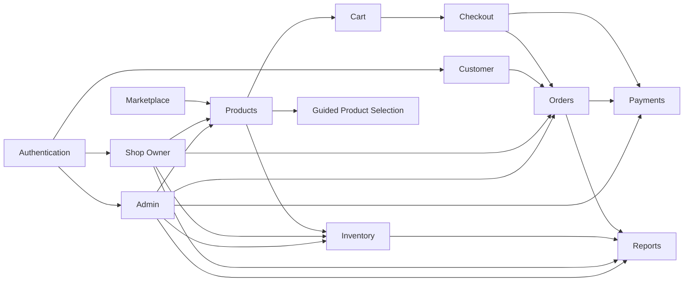

# MODULES.md — Module Reference

> [!IMPORTANT]
> **Read this first.** This is the authoritative map of module ownership: what each module is for, what it owns, and exactly how built it is. Use it to answer *"where does X live?"* and *"is Y already built?"* before writing code.
>
> Business purpose → [README.md → Core Modules](./README.md#core-modules) · Technical design → [ARCHITECTURE.md](./ARCHITECTURE.md) · Why each module is shaped this way → [DECISIONS.md](./DECISIONS.md) · Standards for touching a module → [CLAUDE.md](./CLAUDE.md).
>
> For the canonical **Target vs Current** mapping (roles, tables, payments, cart) referenced throughout the rows below, see [README.md → Implementation Status](./README.md#implementation-status-target-vs-current) — it is not repeated per-module here.

**Status legend:** ✅ Completed · 🚧 In Progress · ⏳ Upcoming (stub only)

---

## 1. Authentication

| Field | Detail |
|---|---|
| **Purpose** | Let Guests become Customers (and staff sign in) securely: registration, login, logout, email verification, password reset. |
| **Responsibilities** | Session issuance/refresh; credential validation; safe error messaging (no account enumeration); redirect-after-auth handling. |
| **Features** | Sign up, sign in, sign out, forgot password, reset password, email verification (PKCE), role-aware post-login redirect, Google/Facebook OAuth sign-in, manual account linking. |
| **Pages** | `src/app/(auth)/{sign-in,sign-up,forgot-password,reset-password}/page.tsx`; `src/app/auth/callback/route.ts` (PKCE exchange for email links, OAuth sign-in, and OAuth account linking — not a page). |
| **Components** | `features/auth/components/forms/{LoginForm,RegisterForm,ForgotPasswordForm,ResetPasswordForm}`; `fields/{EmailInput,PasswordInput}`; `layout/{AuthCard,AuthHeader,AuthFooter,AuthLayout,EditorialPanel}`; `feedback/{VerificationPending,AuthSuccessState}`; `social/{SocialLoginButtons,SocialButton,Divider,icons}`; `AuthButton`. Account linking UI lives in the Customer Account module: `features/account/components/{ConnectedAccounts,UnlinkIdentityButton}`. |
| **Server Actions** | `features/auth/actions/auth.actions.ts` — `signInAction`, `signUpAction`, `signOutAction`, `signInWithOAuthAction`, `requestPasswordResetAction`, `updatePasswordAction`, `resendVerificationAction`. Linking lives with the Account module: `features/account/actions/account.actions.ts` — `linkIdentityAction`, `unlinkIdentityAction`. |
| **Services** | `lib/supabase/queries.ts` (auth section) — `signInWithPassword`, `signUpWithPassword`, `signInWithOAuth`, `signOut`, `sendPasswordResetEmail`, `updatePassword`, `resendVerificationEmail`, `getSessionUser`, `listUserIdentities`, `linkOAuthIdentity`, `unlinkOAuthIdentity`. |
| **Database Tables** | `auth.users`/`auth.identities` (Supabase-managed) · `profiles` (via `handle_new_user` trigger, auto-creates a `buyer` profile row; reads Google's and Facebook's differently-named metadata keys). |
| **Dependencies** | `src/proxy.ts` (session refresh + route gating), `src/constants/routes.ts` (`AUTH_ROUTES`, `PROTECTED_ROUTE_PREFIXES`), `auth-errors.ts` (error mapping, incl. OAuth callback codes). |
| **Current Status** | ✅ Completed, including Google/Facebook OAuth. Account-matching for OAuth is entirely Supabase Auth's (GoTrue's) own verified-email identity linking — this app never implements its own email-based account matching (see [DECISIONS.md](./DECISIONS.md) for the rationale). Manual linking (Connected Accounts on `/profile`) is the sanctioned fallback for cases automatic linking can't safely cover, e.g. Facebook without a provider-verified email. |
| **Future Work** | Seller self-upgrade flow — explicitly out of scope today (see [README.md → Out of Scope](./README.md#out-of-scope)). Retroactively merging an already-separate duplicate account's order history into a primary account (created when Facebook auto-linking didn't apply) is a manual admin data-migration operation, not built. |

---

## 2. Marketplace

| Field | Detail |
|---|---|
| **Purpose** | The unified storefront experience across all three shops: the landing page and category browsing that make three shops feel like one marketplace. |
| **Responsibilities** | First-impression storefront (hero, featured products/shops, marketplace value props); category-based discovery; entry point into Products. |
| **Features** | Landing hero, featured products/shops, marketplace features section, animated stats, category grid, guided-selection preview teaser. |
| **Pages** | `src/app/(marketing)/page.tsx` (home); `src/app/(shop)/categories/page.tsx`, `categories/[slug]/page.tsx`. |
| **Components** | `features/landing/components/*` (Hero, FeaturedProducts, FeaturedProductsGrid, FeaturedShops, MarketplaceFeatures, SmartAssistantPreview, LandingNavbar, LandingFooter, AboutSection, AnimatedCounter, AnnouncementBar, BackToTop, EditorialBanner, MarqueeBand, ProductCategories, Reveal); `features/categories/components/{CategoryCard,CategoryGrid}`. |
| **Server Actions** | None (read-only, presentational). |
| **Services** | `lib/supabase/queries.ts` (landing stats + categories sections) — `getMarketplaceStats`, category listing queries. |
| **Database Tables** | `categories`, `products` (aggregated), `profiles` (featured-shop placeholder data — see caveat below). |
| **Dependencies** | Products module (links into product listing/detail); no direct dependency on Cart/Checkout. |
| **Current Status** | ✅ Completed (`landing-page-implementation-plan.md` marked Implemented 2026-08-03). |
| **Future Work** | "Featured Shops" is currently a **documented placeholder** — there is no `shops` entity yet (see [DECISIONS.md → ADR-001](./DECISIONS.md#adr-001-marketplace-scoped-to-three-sibling-shops)); wire it to real shop data once the target schema lands. |

---

## 3. Products

| Field | Detail |
|---|---|
| **Purpose** | The product catalog: listing, search, filtering, and detail pages for finished-garment inventory across the three shops. |
| **Responsibilities** | Catalog browsing UX; search/filter/pagination; product detail presentation; related-product suggestions. |
| **Features** | Catalog grid with pagination, filters, search input, breadcrumbs, product detail gallery, related products. |
| **Pages** | `src/app/(shop)/products/page.tsx`; `products/[slug]/{page,loading,not-found}.tsx`. |
| **Components** | `features/products/components/{Breadcrumbs,CatalogHeader,PaginationControls,ProductCard,ProductFilters,ProductGallery,ProductGrid,ProductGridSkeleton,ProductListSection,ProductSearchInput,RelatedProducts}`. |
| **Server Actions** | `features/products/actions/product.actions.ts` — create (seller-only) /update/archive (guarded by `requireRole`), consumed by the Shop Owner Portal (`/seller/*`) and Admin Portal (`/admin/*`). |
| **Services** | `lib/supabase/queries.ts` (products section) — `getProductBySlug` (React `cache()`), listing/search/filter queries, `toProduct` mapper. |
| **Database Tables** | `products`, `product_images`, `categories` (FK). |
| **Dependencies** | Marketplace (entry point), Cart (add-to-cart), Inventory (owns stock; `products.quantity` is a synced mirror — see [Inventory](#4-inventory)). |
| **Current Status** | ✅ Completed for browsing/detail and for Shop Owner/Admin management (see [Admin](#11-admin) and [Shop Owner](#12-shop-owner)). |
| **Future Work** | None outstanding. |

---

## 4. Inventory

| Field | Detail |
|---|---|
| **Purpose** | Track and adjust stock levels per shop so updates happen once, centrally — solving the SAD's "inventory updates are repetitive and slow" problem. |
| **Responsibilities** | Stock level tracking per product; low/out-of-stock visibility; manual stock adjustment (restock/correction/shrinkage/other) by shop owners/admin; append-only stock movement history; keeping `products.quantity` accurate for every other module without those modules changing. |
| **Features** | Dashboard stock list (cross-shop for admin, own-shop for a seller — same page, role-branched, per the Admin/Shop Owner "role-scoped view" convention below); manual stock adjustment with a required reason and optional note; per-product stock history panel; in-stock/low-stock/out-of-stock status derived from `quantity` vs. a per-product `low_stock_threshold`; automatic restock on order cancellation; automatic `sold ⇄ active` status sync. |
| **Pages** | `src/app/admin/inventory/page.tsx` and `src/app/seller/inventory/page.tsx` — same shared `InventoryTable` and query, role-scoped by owner (`null` for admin, `{sellerId, shopId}` for seller); `src/app/dashboard/inventory/page.tsx` is a legacy redirect to whichever applies. |
| **Components** | `features/inventory/components/{InventoryTable,InventoryRow,StockStatusBadge,StockAdjustmentForm,StockHistoryPanel}`. |
| **Server Actions** | `features/inventory/actions/inventory.actions.ts` — `adjustStockAction` (guarded by `requireRole(DASHBOARD_ROLES)` + rate limiting), `getStockHistoryAction`. |
| **Services** | `lib/supabase/queries.ts` (inventory section) — `listDashboardInventory`, `getInventoryForProduct`, `adjustStock` (wraps the `adjust_stock` RPC), `listStockAdjustments`. `updateProduct()` (Products module) reroutes any submitted `quantity` through `adjustStock()` first, so the generic product-edit form still works but every stock write funnels through one audited path. |
| **Database Tables** | Dedicated `inventory` (one row per product; `quantity`, `low_stock_threshold`) and append-only `stock_adjustments` (audit log — delta, previous/new quantity, reason, note, related order, actor). `products.quantity` remains as a trigger-synced, read-only-by-convention mirror (column-level `REVOKE UPDATE` for `authenticated`) so every buyer-facing read path (PDP, catalog tiles, cart, `getProductsPriceAndStock`) is unaffected. See [ARCHITECTURE.md → Current Database Mapping](./ARCHITECTURE.md#current-database-mapping-target-vs-current). |
| **Dependencies** | Products (`products_seed_inventory`/`products_sync_inventory_shop` triggers keep an inventory row in lockstep with every product); Orders (`create_order` locks/decrements `inventory`; an `orders_restock_on_cancel` trigger restocks automatically on cancellation — no change needed in `order.actions.ts`). |
| **Current Status** | ✅ Completed. Resolves ARCHITECTURE.md TD-2. |
| **Future Work** | A failed/rejected QR payment does not restock today — deliberately deferred as ARCHITECTURE.md TD-9 pending a Payments-module business-rule decision. Multi-location stock (the `inventory` schema's 1:1 product:row shape leaves room for this without a breaking change) is unplanned/speculative — do not build ahead of a stated need. |

---

## 5. Cart

| Field | Detail |
|---|---|
| **Purpose** | Hold products from any of the three shops in one place before checkout — the "unified cart" the SAD calls for. |
| **Responsibilities** | Add/remove/update line items; persist across page loads (not devices); expose totals to Checkout. |
| **Features** | Add to cart, quantity update, remove item, cart summary, persistent guest cart. |
| **Pages** | `src/app/(shop)/cart/page.tsx` (intentionally **public** — see [DECISIONS.md → ADR-013](./DECISIONS.md#adr-013-guest-cart-is-client-side-only)). |
| **Components** | `features/cart/components/{AddToCartButton,CartSummary}`. |
| **Server Actions** | None — cart is client-only until checkout. |
| **Services** | `features/cart/providers/CartProvider` (Context), `features/cart/hooks/useCart`, `features/cart/utils/cart-reducer` (localStorage-backed `useReducer`). |
| **Database Tables** | None — no server-side cart table by design. |
| **Dependencies** | Products (source of line items); Checkout (consumes cart state, groups by seller). |
| **Current Status** | ✅ Completed. |
| **Future Work** | Optional authenticated-user cart sync across devices (see ADR-013 future revisit) — not currently planned. |

---

## 6. Checkout

| Field | Detail |
|---|---|
| **Purpose** | Convert a cart spanning multiple shops into one order per shop, capturing shipping details and a payment method. |
| **Responsibilities** | Group cart by seller; collect shipping address; select payment method; invoke order creation; surface per-shop totals. |
| **Features** | Shipping address form (country locked to Philippines — domestic-only, no courier API), per-shop order grouping, payment method selection (COD or QR Transfer — QR is informational only at this step, see Payments), order totals, order-confirmation page, empty-cart handling. |
| **Pages** | `src/app/(shop)/checkout/page.tsx`, `checkout/confirmation/page.tsx` (both protected routes). |
| **Components** | `features/checkout/components/{CheckoutEmptyState,CheckoutForm,CheckoutGroupCard,CheckoutItemsList,CheckoutTotals,PaymentMethodCard,ShippingAddressForm}`. |
| **Server Actions** | `features/checkout/actions/checkout.actions.ts` — `placeOrderAction`. |
| **Services** | `lib/supabase/queries.ts` — `createOrder` (wraps the `create_order` RPC), `getBuyerOrder` (confirmation page); `features/checkout/utils/groupCartBySeller`. |
| **Database Tables** | Writes `orders`, `order_items` via `create_order`; reads `products` for price/stock validation. |
| **Dependencies** | Cart (source), Orders (target of creation), Payments (method selection + the actual receipt-upload/verification flow, which lives entirely in the Payments module, not here). |
| **Current Status** | ✅ Completed (the Stripe/card spike, ADR-014, was removed — see [DECISIONS.md → ADR-014](./DECISIONS.md#adr-014-stripe-integration-is-a-provisional-spike)). |
| **Future Work** | None outstanding — `create_order` is deliberately unchanged by the QR payment work; payment method is not persisted at order-placement time (see Payments module). Assumes a single currency (PHP) across a cart — documented assumption, not a supported multi-currency checkout. |

---

## 7. Orders

| Field | Detail |
|---|---|
| **Purpose** | The single, centralized order pipeline — creation through fulfillment through history — shared by Customers, Shop Owners, and Admin. |
| **Responsibilities** | Order lifecycle state machine; order history and detail views; cancellation; fulfilment status advancement; status/timeline presentation. |
| **Features** | Buyer: order list with search/status filter, order detail with timeline, shipping address display, payment-status badge, cancel-order action (`pending`/`confirmed` only). Shop Owner/Admin: dashboard order list (RLS-scoped to own shop, or every shop for admin), order detail with fulfilment controls, forward status advancement (`pending → confirmed → processing → shipped → delivered`) and cancellation (`pending`/`confirmed`/`processing`), one unified transition map governing both. |
| **Pages** | `src/app/(account)/orders/page.tsx`, `orders/[id]/{page,loading,not-found}.tsx` (buyer); `src/app/admin/orders/**` and `src/app/seller/orders/**` (Shop Owner/Admin); `src/app/dashboard/orders/**` is a legacy redirect. |
| **Components** | `features/orders/components/{OrderCard,OrderHeader,OrderItemsList,OrderListSection,DashboardOrdersPanel,OrderSearchInput,OrderSkeletons,OrderStatusBadge,OrderStatusFilter,OrderSummary,OrderTimeline,PaymentStatusBadge,ShippingAddressCard,CancelOrderButton,OrderStatusControl}`. `OrderStatusControl` is the dashboard's fulfilment/cancel control (mirrors `CancelOrderButton`'s confirm-dialog shape, driven by `ORDER_STATUS_TRANSITIONS`); every other component is shared as-is between the buyer and dashboard views — `OrderCard` takes an optional `href` override so the two contexts link to their own detail route. |
| **Server Actions** | `features/orders/actions/order.actions.ts` — `cancelOrderAction` (buyer-side); `advanceOrderStatusAction` (Shop Owner/Admin — handles both forward advancement and dashboard-initiated cancellation through one path, guarded by `requireRole(DASHBOARD_ROLES)` + `ORDER_STATUS_TRANSITIONS`, not just the DB trigger). |
| **Services** | `lib/supabase/queries.ts` — `getBuyerOrder`/`listBuyerOrders`/`getBuyerOrderSummary`/`cancelBuyerOrder` (buyer-scoped, hardcode `buyer_id`); `getDashboardOrder`/`listDashboardOrders` (RLS-only, no manual filter — same "RLS is the primary boundary" pattern as `listDashboardProducts`/`listDashboardInventory`); `advanceOrderStatus` (validates the transition, then an optimistic-concurrency-guarded update); `toOrder` mapper (now also carries `buyerId`/`buyerName`, needed for the dashboard view). |
| **Database Tables** | `orders`, `order_items`; reads `payments` for status. No `shop_id` column and no new migration for this phase — `seller_id = auth.uid()` already scopes a Shop Owner to their own orders correctly under today's one-member-per-shop reality (see ARCHITECTURE.md's Orders RLS note). |
| **Dependencies** | Checkout (creates orders); Payments (status; a `payment_status = 'failed'` order has no automatic effect — see TD-9 — but can now be manually cancelled from the dashboard, which restocks via the existing `orders_restock_on_cancel` trigger); Inventory (restock on cancellation, actor-agnostic — buyer, seller, or admin initiated); Customer module (surfaces orders in account); Shop Owner/Admin (this module **is** their order-management surface, not a fork of it). |
| **Current Status** | ✅ Completed for both the Customer-facing history/detail experience and Shop Owner/Admin order management. |
| **Future Work** | An admin refund flow (`refunded` status is defined in the DB enum but unreachable from any UI today) — out of scope until requested. Multi-staff-per-shop order visibility, if that ever becomes real (see ARCHITECTURE.md TD-1) — deliberately not built speculatively. |

---

## 8. Payments

| Field | Detail |
|---|---|
| **Purpose** | Manual, verifiable payment confirmation via **Cash on Delivery** and **QR receipt upload** — no payment gateway, per the SAD. |
| **Responsibilities** | Capture payment method at checkout; store/display uploaded QR receipts; let staff mark a payment verified/rejected; keep `payment_status` server-controlled. |
| **Features** | COD (no action needed — pay on delivery, no `payments` row). QR: buyer uploads a receipt from the order detail page; seller (of that order) verifies/rejects from `/seller/payments`, admin from `/admin/payments`; buyer sees the seller's receiving QR code (`profiles.payment_qr_url`, seller-editable) once they choose QR at checkout. |
| **Pages** | `src/app/admin/payments/page.tsx` and `src/app/seller/payments/page.tsx` — the verification queue (`/dashboard/payments` is a legacy redirect to whichever applies). Receipt upload lives on the order detail page (Orders module), not a dedicated Payments page. |
| **Components** | `features/payments/components/{ReceiptUpload,VerificationQueue,VerificationCard}`; `features/checkout/components/PaymentMethodCard` (method selection, informational only). |
| **Server Actions** | `features/payments/actions/payment.actions.ts` — `submitQrPaymentAction`, `verifyPaymentAction`. |
| **Services** | `lib/supabase/queries.ts` — `uploadPaymentReceipt`, `submitQrPayment`, `verifyPayment`, `getPaymentReceiptSignedUrl`, `listPendingPayments`, `getActivePaymentForOrder`. All writes go through the `submit_qr_payment`/`verify_payment` `SECURITY DEFINER` RPCs (see [ARCHITECTURE.md → Payments RPCs](./ARCHITECTURE.md#payments-rpcs-qr-receipt-upload-manual-verification)) — no direct table grant exists. |
| **Database Tables** | `payments` (Stripe-specific columns dropped — resolved TD-3; now `receipt_path`, `verified_by`, `verified_at`); `profiles.payment_qr_url`; the private `payment-receipts` Storage bucket (first Storage feature in this repo). |
| **Dependencies** | Checkout (method selection UI only — no data dependency, `create_order` is unchanged), Orders (`payment_status` surfaced there; receipt upload lives on the order detail page), Supabase Storage. |
| **Current Status** | ✅ Completed for the SAD's full target scope (COD + QR receipt upload + manual verification). The Stripe/card spike is retired, not provisional (see [DECISIONS.md → ADR-008](./DECISIONS.md#adr-008-manual-payment-verification-cod--qr-receipt-no-gateway) and [ADR-014](./DECISIONS.md#adr-014-stripe-integration-is-a-provisional-spike)). |
| **Future Work** | The verification queue is a single page, not a full Admin/Shop Owner dashboard shell (Inventory/Reports/etc. still don't exist) — a fuller shell is Shops & Inventory / Reports phase work, not a Payments gap. |

---

## 9. Reports

| Field | Detail |
|---|---|
| **Purpose** | Sales and operational analytics for Shop Owners (their own shop) and Administrator (platform-wide, filterable by shop). |
| **Responsibilities** | Aggregate order/sales data DB-side; present KPIs, trends, and breakdowns; support the SAD's "orders and sales are not centralized" problem. |
| **Features** | KPI cards (revenue, orders, paid orders, avg order value, units, cancelled); sales-over-time trend (day/week/month); order-status breakdown; COD-vs-QR paid-payment split; top products; low/out-of-stock report; date-range + preset + granularity filters; admin shop filter; CSV export. |
| **Pages** | `src/app/admin/reports/page.tsx` and `src/app/seller/reports/page.tsx` — role-branched copy (`isAdmin`), Zod-coerced `searchParams` filters, per-panel `Suspense`; `src/app/dashboard/reports/page.tsx` is a legacy redirect. |
| **Components** | `features/reports/components/{ReportsFilters,ExportReportButton,SalesSummaryPanel,SalesTrendPanel,OrderStatusPanel,TopProductsPanel,LowStockPanel,ReportSkeletons}`; shared charts `src/components/charts/{TrendChart,BarChart}` (hand-rolled SVG/CSS, no charting dependency). |
| **Server Actions** | `features/reports/actions/report.actions.ts` — `exportSalesReportAction` (CSV; reuses the same RLS-scoped reads, `requireRole(DASHBOARD_ROLES)`). Reads need no action — panels are async Server Components. |
| **Services** | `lib/supabase/queries.ts` (Reports section) — `getSalesSummary`/`getSalesTimeseries`/`getOrderStatusBreakdown`/`getTopProducts` (wrap the `report_*` RPCs, `cache()`-wrapped), `getLowStockReport` (reuses `listDashboardInventory`, no new SQL). |
| **Database Tables** | **None new.** Four read-only `SECURITY DEFINER` RPCs aggregate over existing `orders`/`order_items`/`payments`; a physical `reports` table was deliberately not modelled (derivable data). See [ARCHITECTURE.md → Reporting RPCs](./ARCHITECTURE.md#reporting-rpcs-analytics-over-existing-orders). Two additive `orders` indexes (`orders_seller_placed_idx`, `orders_placed_at_idx`). |
| **Dependencies** | Orders (primary data source), Payments (`payment_status = 'paid'` is the revenue source of truth; COD-vs-QR split), Inventory (low-stock report, reused), Shops (admin shop filter via `shop_users`). |
| **Current Status** | ✅ Completed. Resolves ARCHITECTURE.md TD-5. |
| **Future Work** | An `orders.shop_id` bridge (TD-1) would let admin shop-filtering skip the `shop_users` map; richer/scheduled exports and materialized aggregates are future scaling, not current scope. |

---

## 10. Guided Product Selection

| Field | Detail |
|---|---|
| **Purpose** | Reduce manual "what do you recommend?" requests with a **rule-based** (not AI) recommendation assistant, per the SAD. |
| **Responsibilities** (target) | Evaluate explicit rules (category, price range, tags, stated preference) against the catalog; present suggested products to Guests and Customers. |
| **Features** (target) | Guided-selection flow/quiz, rule-matched product suggestions. |
| **Features** (current) | `SmartAssistantPreview` — a **visual preview only** on the landing page; no working rule engine behind it. |
| **Pages** | Reserved at `ROUTES.assistant` (`/assistant`); no page built. |
| **Components** | `features/landing/components/SmartAssistantPreview` (preview only). `src/features/assistant/` is otherwise a stub. |
| **Server Actions** | None. |
| **Services** | None. |
| **Database Tables** (target) | `recommendation_rules` per the target schema (does not exist yet). |
| **Dependencies** | Products (recommendation targets), Categories (rule conditions). |
| **Current Status** | ⏳ Upcoming (stub; landing preview is cosmetic only). |
| **Future Work** | Design the rule schema (conditions → product matches) and build `features/assistant` end-to-end. **Must remain rule-based** — see [DECISIONS.md → ADR-009](./DECISIONS.md#adr-009-rule-based-guided-product-selection-not-ai); do not introduce AI/ML without a superseding ADR. |

---

## 11. Admin

| Field | Detail |
|---|---|
| **Purpose** | Full platform administration: users, shops, products, inventory, payments, reports, settings — the Administrator's SAD scope. |
| **Responsibilities** | Cross-shop oversight; user/role management and seller onboarding; shop creation/management; payment verification authority. Platform settings still unbuilt. |
| **Pages** | `/admin/{dashboard,products,inventory,orders,payments,returns-refunds,reports,users,shops,audit-log,settings}` — the full Admin Portal, gated by `requireRole(ADMIN_ONLY_ROLES)` at `src/app/admin/layout.tsx` (not the coarse seller-or-admin gate the old `/dashboard` tree used). Reports adds an admin-only shop filter. The legacy `/dashboard/*` tree is kept only as redirect stubs to their `/admin/*` or `/seller/*` equivalent (`redirectToPortal`), for old bookmarks. |
| **Components** | `src/app/admin/layout.tsx` + `features/admin/components/{AdminLayout,AdminSidebar,AdminTopbar,AdminKpiRow,AdminQuickAccess}` — the Admin Portal's own chrome (no Buyer `SiteHeader`/`SiteFooter`, scoped Light/Dark/System theme via `[data-theme-scope="admin"]`). `features/users/components/{UsersTable,UserRow}` and `features/shops/components/{AdminShopsPanel,ShopRow,ShopForm}` are the admin-only screens — two separate feature folders (Users is a distinct business domain from Shops, not shoehorned into either `dashboard/` or `shops/`). |
| **Server Actions** | `features/payments/actions/payment.actions.ts` — `verifyPaymentAction`; `features/products/actions/product.actions.ts` — create/update/archive/assign-shop; `features/inventory/actions/inventory.actions.ts` — `adjustStockAction`; `features/orders/actions/order.actions.ts` — `advanceOrderStatusAction`, all usable by admin across every shop (role-branched, not admin-forked). New admin-only actions: `features/shops/actions/shop.actions.ts` — `createShopAction`/`updateShopAction`/`toggleShopActiveAction` (RLS-gated, no RPC needed — `shops` already has `is_admin()` in its policies); `features/users/actions/user.actions.ts` — `assignSellerShopAction` (wraps the `admin_assign_seller_shop` RPC — the one privileged, cross-user write in this module). |
| **Services** | `lib/supabase/queries.ts` — `listAdminUsers()`/`assignSellerShop()` (wrap the `admin_list_users`/`admin_assign_seller_shop` RPCs — see the Seller Onboarding note below); `createShop()`/`updateShop()`/`listShopsWithMembers()` (plain RLS-gated reads/writes, no RPC). `listShops()` itself (used by the Products/Inventory admin shop-picker) is unchanged. |
| **Database Tables** | Cross-cutting: `profiles` (users), `products`, `orders`, `payments`, `inventory`/`stock_adjustments`, `shops`/`shop_users` (admin has full read/write via `is_admin()`); new `admin_action_log` (append-only, admin-only-readable, RPC-only-writable — logs `admin_assign_seller_shop` calls only, deliberately not every admin action). |
| **Dependencies** | Every other module — Admin is an oversight layer, not a data owner of its own. |
| **Current Status** | ✅ Seller onboarding (Users + Shops management) is built — see the Seller Onboarding note below. ⏳ Upcoming: user disabling/banning (no such column exists on `profiles` today — not requested), platform Settings. |
| **Future Work** | Platform settings page. Seller demotion/reversal was explicitly scoped out of the onboarding work — promotion is one-directional; what happens to a demoted seller's shop/active products/pending orders is a real design question, not yet addressed. |

> [!NOTE]
> **Seller Onboarding (Admin-only, no self-service).** `profiles` UPDATE RLS is self-only (`id = auth.uid()`) with no `is_admin()` widening — an admin cannot promote another user via a plain client call, so `admin_assign_seller_shop(p_user_id, p_shop_id)` (`SECURITY DEFINER`, explicit `is_admin()` check inside, mirrors `create_order`/`adjust_stock`'s chokepoint shape) is the sole write path: it flips `profiles.role` from `buyer` to `seller` *and* creates/replaces the `shop_users` membership in one transaction, so there is never a window where a seller exists without a shop. A new `shop_users` `unique (user_id)` constraint (verified safe against live data before adding) backs this up at the schema level — a user can never be in two shops. `admin_list_users()` (a second new `SECURITY DEFINER` RPC, mirroring `get_my_profile()`'s shape but admin- rather than self-scoped) is the only place `auth.users.email` is ever joined into a query, so the admin Users screen can show who's who. Public signup remains Buyer-only and unmodified — `handle_new_user()`, the `profiles` INSERT policy, and `prevent_role_self_escalation` were not touched.

---

## 12. Shop Owner

| Field | Detail |
|---|---|
| **Purpose** | Let each sibling shop manage its own products, inventory, orders, and reports — the Shop Owner's SAD scope. |
| **Responsibilities** (target) | Manage **own** products/inventory only (RLS-scoped); fulfil own orders; view own sales reports. |
| **Pages** | `/seller/{dashboard,products,inventory,orders,payments,reports}` — the Shop Owner Portal, gated by `requireRole([USER_ROLES.seller])` at `src/app/seller/layout.tsx`, scoped to their own shop via RLS (`seller_id = auth.uid()` / `is_shop_member()`) and, for Reports, the `report_*` RPCs' internal seller scoping. The legacy `/dashboard/*` tree is kept only as redirect stubs to `/seller/*` (or `/admin/*` for an admin), for old bookmarks. |
| **Components** | `src/app/seller/layout.tsx` + `features/seller/components/{SellerLayout,SellerSidebar,SellerTopbar,SellerKpiRow,SellerQuickAccess}` — the Seller Portal's own chrome, structurally mirroring Admin's (no Buyer `SiteHeader`/`SiteFooter`, scoped theme via `[data-theme-scope="seller"]`). |
| **Server Actions** | `features/payments/actions/payment.actions.ts` — `verifyPaymentAction`; `features/products/actions/product.actions.ts` — create/update/archive; `features/inventory/actions/inventory.actions.ts` — `adjustStockAction`; `features/orders/actions/order.actions.ts` — `advanceOrderStatusAction`, all scoped to the seller's own shop for their own orders/payments/inventory. |
| **Services** | Same centralized `queries.ts` functions as Products/Orders/Inventory/Payments — **no separate seller-only service layer**. |
| **Database Tables** | `products` (own, via `seller_id` and/or `shop_id`), `inventory`/`stock_adjustments` (own shop's products, via `is_shop_member()`), `orders` (own, via seller-scoped RLS), `payments` (own orders' payments, via `verify_payment`), `shops`/`shop_users` (own shop, via `is_shop_member()`). |
| **Dependencies** | Products, Inventory, Orders, Payments, Reports — Shop Owner is a **role-scoped view** over those modules, not a new data domain. |
| **Current Status** | ✅ Products, Inventory, Orders, payment verification, and Reports are all built and scoped to the seller's own shop — proof the underlying RLS/role guards (`current_user_role() in ('seller','admin')`, `is_shop_member()`, and the `report_*` RPCs' internal `seller_id = auth.uid()` scoping) are correctly scoped. |
| **Future Work** | None outstanding for the SAD scope. Richer/scheduled report exports are future scaling, not current scope. |

---

## 13. Customer

| Field | Detail |
|---|---|
| **Purpose** | The buyer-facing account experience: profile, order history, and an account hub — the Customer's SAD scope. |
| **Responsibilities** | Present the authenticated shopper's identity and history; let them update their profile; surface recent orders. |
| **Features** | Account overview, profile edit, recent-orders summary, navigation to full order history (owned by the Orders module), Connected Accounts (manual Google/Facebook identity linking). |
| **Pages** | `src/app/(account)/account/page.tsx`, `profile/page.tsx` (plus `orders/*`, owned by the Orders module and linked from here). |
| **Components** | `features/account/components/{AccountMenu,AccountShell,AccountSidebar,OverviewSummary,ProfileForm,RecentOrdersList,ConnectedAccounts,UnlinkIdentityButton}`. |
| **Server Actions** | `features/account/actions/account.actions.ts` — `updateProfileAction`, `linkIdentityAction`, `unlinkIdentityAction`. |
| **Services** | `lib/supabase/queries.ts` — `getMyProfile` (via `get_my_profile()` RPC, the only path to `phone`), `toProfile` mapper, `listUserIdentities`/`linkOAuthIdentity`/`unlinkOAuthIdentity` (owned by Authentication, consumed here). |
| **Database Tables** | `profiles`; reads `orders` (via the Orders module, not duplicated here); `auth.identities` (via Authentication's Supabase Auth wrappers). |
| **Dependencies** | Authentication (identity, and the OAuth linking primitives Connected Accounts is built on), Orders (`RecentOrdersList` composes the Orders module — does not reimplement it). |
| **Current Status** | ✅ Completed. |
| **Future Work** | Saved shipping addresses, wishlists — both explicitly out of scope per `customer-account-architecture-plan.md` and [README.md → Out of Scope](./README.md#out-of-scope) precedent. |

---

## Cross-Module Dependency Map

> [!NOTE]
> **Admin and Shop Owner do not own separate data models.** Both are role-scoped **views** over Products, Inventory, Orders, Payments, and Reports, differentiated entirely by RLS/role guards. Do not fork parallel components or services for these roles — extend the existing module and gate by role, per [CLAUDE.md → AI Non-Negotiable Rules](./CLAUDE.md#ai-non-negotiable-rules).

---

### Related documents

- 🧭 **[README.md](./README.md)** — business overview, scope, roadmap.
- 📐 **[ARCHITECTURE.md](./ARCHITECTURE.md)** — technical design, schema, RBAC.
- 📜 **[DECISIONS.md](./DECISIONS.md)** — why each module is shaped the way it is.
- 🤖 **[CLAUDE.md](./CLAUDE.md)** — standards for touching any module.
