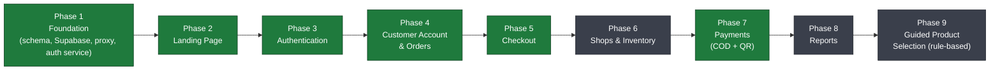
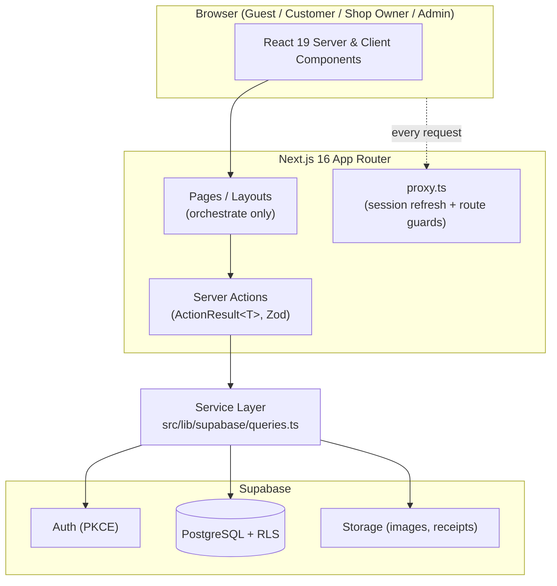
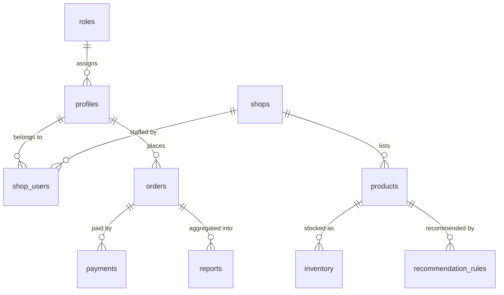

# RoberJ Online Shop — A Web-Based Marketplace & Management System with Smart Order Assistant

> [!IMPORTANT]
> **Read this first.** Read the core three docs in order before writing any code:
> 1. **`README.md`** (this file) — business context, scope, roadmap, repository map.
> 2. **[`ARCHITECTURE.md`](./ARCHITECTURE.md)** — technical design, database schema, RBAC, flows.
> 3. **[`CLAUDE.md`](./CLAUDE.md)** — the working agreement for AI assistants and developers (standards, workflow, non-negotiables).
>
> Then, as needed: **[`MODULES.md`](./MODULES.md)** (what exists, per module) and **[`DECISIONS.md`](./DECISIONS.md)** (why it's built this way). See [Documentation Hierarchy](#documentation-hierarchy) for the full map and conflict-resolution order.
>
> The **Software Architecture Document (SAD)** is the authoritative business specification. Where anything here disagrees with the SAD on a *business* rule, the SAD wins. Where the *code* currently disagrees with the SAD, see **[Implementation Status (Target vs Current)](#implementation-status-target-vs-current)** — the target is the SAD; the code is catching up.

---

## Project Vision

RoberJ Online Shop is a **centralized, web-based marketplace and management system** that unifies **three sibling shops** — today operating separately — into a single storefront with one cart, one checkout, and one order pipeline. It gives shoppers a modern retail experience for **finished garments**, gives each shop owner a single place to manage products, inventory, and orders, and gives the administrator full oversight of the platform.

The long-term vision is a dependable, maintainable capstone-grade system that a small family business can actually run: **one marketplace, unified inventory, guided (rule-based) product selection, and manual-but-verifiable payments** — with no dependence on third-party payment gateways or courier APIs.

---

## Business Problems

The three sibling shops operate independently, which creates real, recurring pain:

| # | Problem |
|---|---------|
| 1 | The three sibling shops operate separately, with no shared storefront. |
| 2 | Inventory is managed across multiple, disconnected platforms. |
| 3 | Customers cannot combine purchases across the shops in a single transaction. |
| 4 | Inventory updates are repetitive and slow. |
| 5 | Orders and sales are not centralized, making oversight difficult. |
| 6 | Customers manually ask for recommendations before ordering. |
| 7 | Manual, back-and-forth communication slows the whole ordering process. |

---

## Proposed Solution

RoberJ addresses each problem with a focused, centralized capability:

| Solution | Solves |
|----------|--------|
| **Centralized multi-shop marketplace** | #1, #3 |
| **Unified inventory management** | #2, #4 |
| **Unified cart and checkout** | #3 |
| **Guided Product Selection (rule-based)** | #6, #7 |
| **Centralized order management** | #5 |
| **Reports and analytics** | #5 |
| **Manual payment verification** (COD + QR receipt upload) | #5, #7 |

> [!NOTE]
> Guided Product Selection is a **rule-based** assistant. It is **not** artificial intelligence, machine learning, or an LLM. Recommendations come from explicit, human-authored rules.

---

## Project Objectives

1. Combine the three sibling shops into **one marketplace** with a shared catalog.
2. Provide **unified inventory management** so stock is maintained once, not per platform.
3. Enable a **single cart and checkout** spanning products from multiple shops.
4. Offer **rule-based Guided Product Selection** to reduce manual recommendation requests.
5. **Centralize orders and sales** for the owners and administrator.
6. Deliver **reports and analytics** for business decisions.
7. Support **manual payment verification** (COD and QR receipt upload) without a payment gateway.
8. Enforce **role-based access control** so each user sees only what they should.
9. Ship a **responsive, accessible, maintainable** application built on a clean, service-oriented architecture.

---

## Marketplace Overview

RoberJ is a **curated, three-shop marketplace** — **not** a general, open multi-vendor platform. Only the **three sibling shops** may list products. Every product belongs to one shop; the shopper experiences them as one catalog.

**How it works, end to end:**

1. A **Guest** browses the unified catalog, searches, and uses Guided Product Selection — no account required.
2. To buy, the guest registers and becomes a **Customer**.
3. The Customer adds products **from any of the three shops** to a **single cart**.
4. At **checkout**, the cart is grouped by shop, and the Customer chooses a manual payment method: **Cash on Delivery** or **QR receipt upload**.
5. Each shop receives its portion of the order; the **Shop Owner** confirms, fulfils, and updates status.
6. The **Administrator** oversees users, shops, products, inventory, payments, and reports across the whole platform.

**Worked example:**

> A Customer adds a *blouse from Shop A* and *two shirts from Shop B* to one cart. At checkout they upload a **QR payment receipt**. The order is split so **Shop A** sees the blouse line and **Shop B** sees the two shirt lines. The **Administrator** verifies the uploaded receipt, marks the payment confirmed, and both shop owners fulfil their items — all tracked in one centralized order pipeline.

---

## Project Scope

The current capstone scope, taken directly from the SAD:

### Customer
- Register / Login
- Browse the unified catalog
- Cart (across shops)
- Checkout
- Order Tracking

### Shop Owner
- Dashboard
- Products
- Inventory
- Orders
- Reports

### Administrator
- Dashboard
- Users
- Shops
- Products
- Inventory
- Payments
- Reports
- Settings

---

## Out of Scope

Explicit **system limitations** from the SAD. These are intentional exclusions, not backlog gaps:

- ❌ Only the **three sibling shops** are supported (not an open multi-vendor marketplace).
- ❌ **Finished garments only** (no raw materials or production tracking).
- ❌ Guided Product Selection is **rule-based**, not AI.
- ❌ **Manual inventory updates** (no automated stock syncing from external systems).
- ❌ **No raw-material or production tracking.**
- ❌ **COD and QR receipt upload only** for payments.
- ❌ **No payment gateway** and **no courier/shipping API** integration.
- ❌ **Internet connection required** (no offline mode).

---

## User Roles

| Role | Authentication | Core Responsibilities | Key Permissions |
|------|----------------|-----------------------|-----------------|
| **Guest** | None | Discover the catalog | Browse, Search, Guided Product Selection |
| **Customer** | Required | Shop and track orders | Checkout, Orders, Profile (plus all Guest abilities) |
| **Shop Owner** | Required | Run their own shop | Manage **own** products, inventory, orders, reports |
| **Administrator** | Required | Operate the platform | Full system administration (users, shops, products, inventory, payments, reports, settings) |

> [!NOTE]
> **Guest** is simply an unauthenticated visitor. **Shop Owner** authority is scoped to their **own** shop's data; the **Administrator** is the only role with platform-wide authority. See [`ARCHITECTURE.md` → RBAC Model](./ARCHITECTURE.md#rbac-model) for how this is enforced.

---

## Core Modules

| Module | Purpose |
|--------|---------|
| **Authentication** | Registration, login, logout, email verification, password reset, session management. |
| **RBAC** | Role-based access control across Guest / Customer / Shop Owner / Administrator. |
| **Marketplace** | The unified, three-shop storefront and catalog experience. |
| **Products** | Product listings, detail pages, search, filtering, categories. |
| **Inventory** | Per-shop stock levels, maintained manually by shop owners and admin. |
| **Cart** | A single cart holding products from any of the three shops. |
| **Checkout** | Cart-to-order conversion, grouped by shop, with a manual payment method. |
| **Orders** | Centralized order lifecycle, tracking, and status management. |
| **Payments** | Manual verification of **COD** and **QR receipt upload** payments. |
| **Reports** | Sales and operational analytics for shop owners and admin. |
| **Guided Product Selection** | Rule-based assistant that recommends products from explicit rules. |

Detailed purpose, boundaries, and interactions for each module are in [`ARCHITECTURE.md`](./ARCHITECTURE.md) and [`CLAUDE.md` → Module Boundaries](./CLAUDE.md#module-boundaries). For the full per-module reference — pages, components, actions, services, tables, dependencies — see **[`MODULES.md`](./MODULES.md)**.

---

## Current Development Status

> [!WARNING]
> The repository is **mid-build** and does not yet fully match the SAD target. The status below reflects what exists in `src/` **today**. Read it together with [Implementation Status (Target vs Current)](#implementation-status-target-vs-current).

### Module Maturity Table

| Module | Status | Where it lives |
|--------|--------|----------------|
| Landing Page | ✅ Completed | `src/features/landing`, `src/app/(marketing)` |
| Authentication | ✅ Completed | `src/features/auth`, `src/app/(auth)`, `src/app/auth/callback` |
| Products / Catalog | ✅ Completed | `src/features/products`, `src/app/(shop)/products` |
| Categories | ✅ Completed | `src/features/categories`, `src/app/(shop)/categories` |
| Cart | ✅ Completed | `src/features/cart`, `src/app/(shop)/cart` |
| Customer Account | ✅ Completed | `src/features/account`, `src/app/(account)` |
| Orders | ✅ Completed | `src/features/orders`, `src/app/(account)/orders` |
| Checkout | ✅ Completed (COD only — QR payment method is Phase 7/Payments scope) | `src/features/checkout`, `src/app/(shop)/checkout` |
| Shops (multi-shop model) | ⏳ Upcoming | *(target schema; not yet built)* |
| Inventory (dedicated module) | ⏳ Upcoming | `src/features/inventory` *(stub)* |
| Payments (COD + QR verification) | ✅ Completed | `src/features/payments`; receipt upload on the order detail page; verification queue at `/dashboard/payments` |
| Reports | ⏳ Upcoming | `src/features/reports` *(stub)* |
| Guided Product Selection | ⏳ Upcoming | `src/features/assistant` *(stub; landing preview only)* |

Legend: ✅ Completed · 🚧 In Progress · ⏳ Upcoming

---

## Development Roadmap

Development follows a **backend/data-first, then front-loaded UI** cadence, closing every module with a lint / typecheck / build verification pass.



> [!NOTE]
> Phase 7 (Payments) landed before Phase 6 (Shops & Inventory) — it had no dependency on the
> shops/inventory schema work, so it wasn't blocked on phase order. Noted here rather than
> silently reordering the roadmap.

| Phase | Focus | State |
|-------|-------|-------|
| 1 | Foundation — schema, Supabase clients, `proxy.ts`, auth service/actions | ✅ |
| 2 | Landing Page | ✅ |
| 3 | Authentication (UI + flows) | ✅ |
| 4 | Customer Account & Order Tracking | ✅ |
| 5 | **Checkout** | ✅ |
| 6 | Shops & Inventory (align to SAD multi-shop model) | ⏳ |
| 7 | Payments — COD + QR receipt upload + manual verification | ✅ |
| 8 | Reports & analytics | ⏳ |
| 9 | Guided Product Selection (rule-based) | ⏳ |

---

## System Architecture

RoberJ is a **server-first Next.js App Router** application backed by **Supabase** (Auth, PostgreSQL, Storage). Business logic lives in a **service layer**; pages orchestrate, components present.



- **Frontend** — Next.js 16 App Router, React 19, TypeScript, Tailwind CSS v4, feature-first structure.
- **API Layer** — Next.js **Server Actions** returning a typed `ActionResult<T>`; input validated with **Zod** at the boundary.
- **Service Layer** — a single centralized data-access module (`src/lib/supabase/queries.ts`) that owns every database read/write.
- **Database** — Supabase PostgreSQL with **Row-Level Security (RLS)** as the primary authorization boundary.
- **Authentication** — Supabase Auth (email/password, PKCE email verification), session refreshed in `proxy.ts`.
- **Storage** — Supabase Storage for product images (and, per the SAD, QR payment receipts).
- **Role-Based Access** — enforced in depth: RLS → SECURITY DEFINER helpers → service-layer role guards → route guards.

Full detail, including sequence diagrams, is in [`ARCHITECTURE.md`](./ARCHITECTURE.md).

---

## Database Overview

The **target** schema (per the SAD Database Architecture) centers on shops, their products and inventory, and centralized orders and payments.



**Target tables (SAD):** `profiles`, `roles`, `shops`, `shop_users`, `products`, `inventory`, `orders`, `payments`, `recommendation_rules`, `reports`.

> [!NOTE]
> The **current** database implements a subset (`profiles`, `categories`, `products`, `product_images`, `orders`, `order_items`, `payments`) with roles stored on `profiles`. The full target-vs-current mapping, ERD, and RLS model are in [`ARCHITECTURE.md` → Target Database Schema](./ARCHITECTURE.md#target-database-schema).

---

## Folder Structure

```text
roberj-onlineshop/
├── README.md              ← business overview + repository map (this file)
├── ARCHITECTURE.md        ← technical design, schema, RBAC, flows
├── CLAUDE.md              ← AI/developer working agreement (imports AGENTS.md)
├── AGENTS.md              ← Next.js 16 ground rules (do not modify)
├── .env.example           ← environment template
├── next.config.ts         ← Next.js config (image remote patterns, turbopack root)
├── supabase/migrations/   ← SQL migrations (schema, RLS, functions, triggers)
├── scripts/               ← Node E2E helper scripts (e2e-flow)
├── public/                ← static assets
└── src/
    ├── app/               ← App Router routes ONLY (pages orchestrate; never touch the DB)
    │   ├── (marketing)/   ← landing / home
    │   ├── (auth)/        ← sign-in, sign-up, forgot/reset password
    │   ├── (shop)/        ← products, categories, cart, checkout
    │   ├── (account)/     ← account, profile, orders, orders/[id]
    │   └── auth/callback/ ← PKCE / email-link exchange route handler
    ├── components/        ← shared, business-agnostic UI (ui/, layout/, feedback/, forms/, …)
    ├── features/          ← self-contained business domains (see below)
    ├── lib/               ← Supabase clients, auth helpers, utils, validations
    │   └── supabase/      ← client.ts, server.ts, session.ts, queries.ts, database.types.ts
    ├── hooks/             ← shared React hooks
    ├── providers/         ← app-wide providers (Query, App)
    ├── services/          ← reserved for cross-feature services
    ├── config/            ← env.ts (validated), site.ts
    ├── constants/         ← routes, roles, statuses, query-keys (no hardcoding elsewhere)
    ├── types/             ← shared types (ActionResult, pagination, common)
    └── proxy.ts           ← Next.js 16 middleware (session refresh + route protection)
```

**Feature anatomy** — each domain under `src/features/<name>/` follows a consistent shape:

```text
features/<name>/
├── actions/     ← "use server" Server Actions (Zod → guard → service → revalidate)
├── components/  ← presentation for this domain
├── hooks/       ← domain hooks
├── providers/   ← domain context (e.g. cart)
├── schemas/     ← Zod schemas
├── services/    ← domain-specific service helpers
├── types/       ← domain models (camelCase) distinct from DB row types
├── constants/   ← domain constants (status flows, labels)
└── index.ts     ← public barrel
```

> Full folder responsibilities are documented in [`CLAUDE.md` → Folder Responsibilities](./CLAUDE.md#folder-responsibilities).

---

## Getting Started

**Prerequisites:** Node.js ≥ 20.9, npm, and a Supabase project.

```bash
# 1. Install dependencies
npm install

# 2. Create your local environment file from the template
cp .env.example .env.local
#    Fill in your Supabase URL + anon key. The app validates env at startup
#    (src/config/env.ts) and fails fast with an actionable message if misconfigured.

# 3. Run the dev server
npm run dev
```

### Scripts

| Command | Purpose |
|---------|---------|
| `npm run dev` | Start the development server |
| `npm run build` | Production build |
| `npm run start` | Serve the production build |
| `npm run lint` | ESLint |
| `npm run typecheck` | `tsc --noEmit` |

### Environment variables

Defined and validated in [`src/config/env.ts`](./src/config/env.ts):

| Variable | Required | Notes |
|----------|----------|-------|
| `NEXT_PUBLIC_SUPABASE_URL` | ✅ | Supabase project URL |
| `NEXT_PUBLIC_SUPABASE_ANON_KEY` | ✅ | Supabase anon/public key |
| `NEXT_PUBLIC_SITE_URL` | ➖ | Defaults to `http://localhost:3000` |
| `SUPABASE_SERVICE_ROLE_KEY` | ➖ | Optional; trusted server-side jobs only |

> [!NOTE]
> The app boots on **Supabase credentials alone**. The former Stripe spike (ADR-014) has been **retired and removed** — Checkout offers **COD only** until the target QR-receipt-upload path (ADR-008) ships. See [Implementation Status](#implementation-status-target-vs-current).

> [!TIP]
> This is a **modified Next.js 16**. Its APIs and file conventions differ from older Next.js knowledge (e.g. middleware is `src/proxy.ts`, not `middleware.ts`). Before writing framework code, read the in-repo guides at `node_modules/next/dist/docs/`, as required by [`AGENTS.md`](./AGENTS.md).

---

## UI / UX Principles

The interface follows modern marketplace best practices, inspired by **Lazada, Shopee, Amazon, Nike, and Apple**, and prioritizes:

- **Consistency** — one design language via shared `src/components/ui` primitives and Tailwind v4 tokens.
- **Accessibility** — semantic HTML, keyboard support, sufficient contrast, labeled controls.
- **Responsive design** — mobile-first; every view works from phone to desktop.
- **Reusable components** — compose from the shared component library; never fork one-off UI.
- **Minimalism** — clean, focused, content-first layouts.
- **Four-state discipline** — every async surface handles **loading, error, empty, and success** states.

---

## Implementation Status (Target vs Current)

> [!IMPORTANT]
> The **SAD is the target**. The code is converging toward it. This is the single reconciliation table for the whole repo — read it before assuming a SAD concept exists in code.

| SAD Concept (Target) | Current Implementation | Notes |
|----------------------|------------------------|-------|
| **Customer** role | `buyer` role | Same concept; different label in code (`USER_ROLES.buyer`). |
| **Shop Owner** role | `seller` role | Current model has **seller accounts**, not shop entities. |
| **Administrator** role | `admin` role | Matches. |
| **Guest** | Unauthenticated visitor (no profile) | Matches. |
| `shops` table | ❌ Not implemented | Products currently attach to a **seller** (`products.seller_id`), not a shop. |
| `shop_users` table | ❌ Not implemented | No shop-staffing model yet. |
| `roles` table | Role stored on `profiles.role` (enum) | Roles are an enum column, not a separate table. |
| `inventory` table | `products.quantity` column | Stock is a column on `products`, not a dedicated table. |
| `recommendation_rules` table | ❌ Not implemented | Guided Product Selection is a landing **preview** only; `features/assistant` is a stub. |
| `reports` table | ❌ Not implemented | `features/reports` is a stub. |
| Unified **cart** | Client-side cart (localStorage + `useReducer`) | Guest cart is client-only by design; committed at checkout. |
| **Payments:** COD + QR receipt upload, manual verification | ✅ **Implemented** — COD (no action needed) + QR (buyer uploads a receipt, seller/admin verifies at `/dashboard/payments`) | Matches target. Stripe/card spike removed (ADR-014); its columns were dropped from `payments` when this landed. |

---

## Documentation Hierarchy

When sources disagree, resolve conflicts **top-down**. Business decisions always follow the SAD.

| Priority | Source | Authority over |
|:-------:|--------|----------------|
| 1 | **Software Architecture Document (SAD)** | Business requirements, scope, limitations, roles |
| 2 | **README.md** | Business overview, repository map, navigation |
| 3 | **ARCHITECTURE.md** | Technical architecture, implementation guidance |
| 4 | **CLAUDE.md** | AI workflow, coding standards, conventions |
| 5 | **Existing source code** | Current implementation (may temporarily differ from target) |

> [!WARNING]
> If the source code conflicts with the SAD on a **business rule**, the **SAD wins** and the code is considered behind. Do not "correct" the docs to match divergent code — raise it and align the code to the SAD.

**Supporting documents** sit alongside this hierarchy — they explain and operationalize tiers 1–4, and must stay consistent with them rather than introduce new authority:

| Document | Explains |
|----------|----------|
| **[DECISIONS.md](./DECISIONS.md)** | *Why* each architectural choice in ARCHITECTURE.md was made (ADR log). |
| **[MODULES.md](./MODULES.md)** | *What* exists per module — ownership, files, status. |
| **[CONTRIBUTING.md](./CONTRIBUTING.md)** | *How* to work — workflow, review, verification. |
| **[SECURITY.md](./SECURITY.md)** | How to report vulnerabilities; security model summary. |
| **[CHANGELOG.md](./CHANGELOG.md)** | *When* things shipped. |

---

## Future Enhancements

Beyond the current capstone scope (kept clearly separate from committed scope):

- Automated inventory syncing across shops.
- Payment gateway integration (would supersede the current manual COD/QR model).
- Courier / shipping API integration and live tracking.
- Product reviews and ratings.
- Realtime notifications (Supabase Realtime).
- Saved shipping addresses and wishlists.
- Richer analytics and exportable reports.

> [!NOTE]
> These are **not** in scope for the capstone and must not be implemented without explicit approval. A Stripe spike toward a possible future gateway previously lived in the repo (ADR-014) and has since been removed — it was never committed scope.

---

## Project Mission

> **Unify three sibling shops into one dependable marketplace** — one catalog, one cart, one order pipeline — with rule-based guidance and honest, manually verified payments, built on a clean, role-secure, maintainable architecture that a small family business can run and a team can grow.

---

### Related documents

- 📐 **[ARCHITECTURE.md](./ARCHITECTURE.md)** — system design, database schema, RBAC, sequence diagrams.
- 🤖 **[CLAUDE.md](./CLAUDE.md)** — AI/developer working agreement: standards, workflow, non-negotiables.
- 📜 **[DECISIONS.md](./DECISIONS.md)** — architecture decision records (ADRs).
- 🗂️ **[MODULES.md](./MODULES.md)** — per-module ownership, status, and files.
- 🛠️ **[CONTRIBUTING.md](./CONTRIBUTING.md)** — developer workflow, PR checklist, troubleshooting.
- 🔒 **[SECURITY.md](./SECURITY.md)** — vulnerability reporting and security model.
- 🗓️ **[CHANGELOG.md](./CHANGELOG.md)** — what shipped and when.
- 🧭 **[AGENTS.md](./AGENTS.md)** — Next.js 16 ground rules (authoritative for framework conventions).
